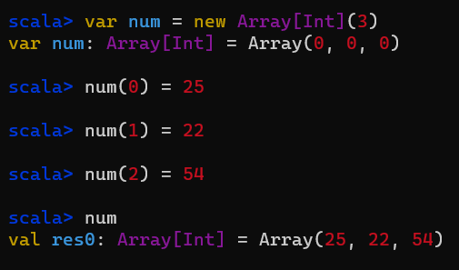
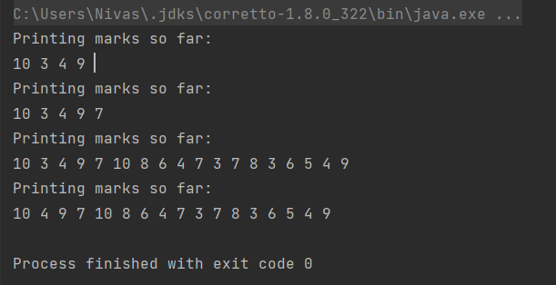

# 13 Arrays: 1

Collection of <mark>**same**</mark> datatype
* index starts with zero always.
<br>
i.e.

```scala
(1, 2, 3, 4, 5)        //Integer Array
("abc", "xyz", "ghi") // String Array
```

100 variables: <br>
* array => num(100) <br>

* for loop to access the array. <br>

### Declaration Of Array

```scala
var num:Array[Int] = new Array[Int](3)
```
* num: name of the array
* Array: Array
* new : creating a object
* Array: name of class
* [Int]: Datatype
* (3): length of array
**Or**
```scala
var num = new Array[Int](3)
num(0) = 25
num(1) = 22
num(2) = 54
```

### REPL: 
```scala

scala> var num = new Array[Int](3)
var num: Array[Int] = Array(0, 0, 0)

scala> num(0) = 25

scala> num(1) = 22

scala> num(2) = 54

scala> num
val res0: Array[Int] = Array(25, 22, 54)

```

num(3) will out of bound error <br>

## Access the Array
```scala
    var marks = Array(62, 82, 55, 66, 63, 73, 85, 53, 55, 65)
    for (mark <- marks) {   //Accessing the elements of array
      println(mark)
    }
```
### Program: Average of Marks:
```scala
object DemoAArrays {
  def main(args: Array[String]): Unit = {
    var marks = Array(62, 82, 55, 66, 63, 73, 85, 53, 55, 65)

    for (mark <- marks) {   //Accessing the elements of array
      println(mark)
    }

    //Average Marks
    var totalMarks = 0
    var averageMarks = 0

    for (mark <- marks) {
      totalMarks += mark
    }
    println(totalMarks)
    averageMarks = totalMarks/marks.length
    println("Average Marsk: " + averageMarks)
  }
}
```
Length of array: array_name.length <br>
We can do the same in java way
```scala
for (i <- 0 to (marks.length - 1)){
  totalMarks += marks(i)
}
```
## map and foreach
### Accessing using foreach loop
```scala
    var marks = Array(62, 82, 55, 66, 63, 73, 85, 53, 55, 65)t
    marks.foreach(println)
```
### Total mark calculations:
```scala
    var marks = Array(62, 82, 55, 66, 63, 73, 85, 53, 55, 65)t
     var totalMarks = 0
    marks.foreach( mark => totalMarks += mark)
```
or we can even shorten the code:
```scala
    marks.foreach(totalMarks += _)
```
Foreach is less code
### Map:
always gets multiple outputs.
i.e.
```scala
    var newMarks = marks.map(mar k => mark + 10) //or
    var newMarks = marks.map(_ + 10) //shorthand notations
```

diff b/w foreach and map:<br>
foreach: can give you single as well as multiple output, we use fn to each array element <br>
map: apply map will give multiple output alwasy <br>
so foreach is better to use.
### Why map:
for operation on each and every element on the array.<br>
foreach iterates each element one by one <br>
but map does it all at once  in parallel and it's very faster than foreach loop.
* if you wanna do same operation on array : Use map you can also use foreach/for loop but it'll be slow.
* if you want to takea sum/get single output (eg.: totalmarks), use foreach
* always return an array but if you want for to return array use: yield<br>
* below code is not preferred use map instead.
```scala
    println("manipulating array using for loop instead -> adding 10 to each element:") //but not preferred
    val result = for(mark <- marks) yield {mark + 10}
    result.foreach(println)
```

### Demo B Array Program
```scala
object DemoBArrays {
  def main(args: Array[String]): Unit = {
    var marks = Array(62, 82, 55, 66, 63, 73, 85, 53, 55, 65)
    //accessing option 1: using for loop
    println("accessing option 1: using for loop:")
    for (mark <- marks) {   //Accessing the elements of array
      println(mark)
    }
  //option 2: using foreach loop
    println("accessing option 2: using foreach loop:")
    marks.foreach(println)

    //Average Marks
    //find avg marks using option 1: for loop and option 2: foreach loop
    var averageMarks = 0
    //option 1: for loop
    var totalMarks = 0
    for (mark <- marks) {
      totalMarks += mark
    }

    //using foreach loop.
    //foreach: can give you single as well as multiple output, we use fn to each array element.

      totalMarks = 0
    marks.foreach(mark => totalMarks += mark)
//  marks.foreach(totalMarks += _) // short hand notation

    //map
    //always gives multiple outputs
    println("manipulating array using map adding 10 to each element:")
    //    var newMarks = marks.map(mark => mark + 10)
    var newMarks = marks.map(_ + 10) //shorthand notations
    newMarks.foreach(println)

    println("manipulating array using for loop instead -> adding 10 to each element:") //but not preferred
    val result = for(mark <- marks) yield {mark + 10}
    result.foreach(println)

    averageMarks = totalMarks/marks.length
    println("Average Marks: " + averageMarks)
  }
}

```
*****END*****
# 14 Arrays 2
Average computation explained below is not of correct way.just ignore it and focus on the examples.
## reduceLeft
* gives single output
* do operation in an array from left
e.g.
```scala
object DemoCArray {
  def main(args: Array[String]): Unit = {
    var marks = Array(62, 82, 55, 66, 63, 73, 85, 53, 55, 65)
    //redeceLeft
    var avg = marks.reduceLeft((x,y) => (x+y)/2)

    var avg2 = marks.reduceLeft((x,y) => {
      println(s" = value of x is :${x} and value of y is: $y and avg is ${(x+y)/2}")
      (x+y)/2
    })
    var avg3 = marks.reduceLeft(_/2 + _/2)

    println(avg)
    println(avg2)
    println(avg3)

  //shorthand notations:
    var totalMarks = marks.reduceLeft(_+_)
    println(s"total marks: $totalMarks")


    var maxMarks = marks.reduceLeft(_ max _)
    println(s"Maximum marks: $maxMarks")

    var minMarks = marks.reduceLeft(_ min _)
    println(s"Minimum marks: $minMarks")

    //without shorthand notation:

    var maxMarks2 = marks.reduceLeft((x,y) => x max y)
    println(s"max2 marks: $maxMarks2")
  }
}
```
## reduceRight: smae as reduceLeft but from right.
```scala
object DemoDArray {
  def main(args: Array[String]): Unit = {
    var marks = Array(62, 82, 55, 66, 63, 73, 85, 53, 55, 65)

    //redeceRight
    var avg = marks.reduceRight((x,y) => (x+y)/2)

    var avg2 = marks.reduceRight((x,y) => {
      println(s" = value of x is :${x} and value of y is: $y and avg is ${(x+y)/2}")
      (x+y)/2
    })
    var avg3 = marks.reduceRight(_/2 + _/2)

    println(avg)
    println(avg2)
    println(avg3)

    //shorthand notations:
    var totalMarks = marks.reduceRight(_+_)
    println(s"total marks: $totalMarks")


    var maxMarks = marks.reduceRight(_ max _)
    println(s"Maximum marks: $maxMarks")

    var minMarks = marks.reduceRight(_ min _)
    println(s"Minimum marks: $minMarks")

    //without shorthand notation:

    var maxMarks2 = marks.reduceRight((x,y) => x max y)
    println(s"max2 marks: $maxMarks2")
  }
}

```
## Multi-Dimensional Array:
* to define a multi-dimensinal array we need to import array. i.e.

```scala
import Array._
```
Eg,
```scala
import Array._
//multi-Dimensional array
object DemoEArray {
  def main(args: Array[String]): Unit = {
      //2D array
    var matrixEg = ofDim[Int](3,3)
    for (row <- 0 to 2){
      for (column <- 0 to 2){
        matrixEg(row)(column)  = column + 3
      }
    }
    for (row <- 0 to 2){
      for (column <- 0 to 2){
        print(matrixEg(row)(column) + " ")
      }
      println()
    }
  }
}
```

### Identity matrix:
```scala
import Array._
//multi-Dimensional array
object DemoEArray {
  def main(args: Array[String]): Unit = {
      //2D array
    var matrixEg = ofDim[Int](5,5)
    for (row <- 0 to 4){
      for (column <- 0 to 4){
        if (row == column){
          matrixEg(row)(column)  = 1
        }
        else{
          matrixEg(row)(column) = 0
        }
      }
    }
    for (row <- 0 to 4){
      for (column <- 0 to 4){
        print(matrixEg(row)(column) + " ")
      }
      println()
    }
  }
}
```
scala looop: for i.e
```scala
    for (row <-0 to 4; column <- 0 to 4){
      if (row == column){
        matrixEg(row)(column) = 1
      }
      else {
        matrixEg(row)(column) = 0
      }
    }
```
## Concatenate: 
```scala
    var marks1 = Array(5, 7, 6, 7, 8, 9, 10)
    var marks2 = Array(9, 4, 6, 2, 7, 8, 3)

    var allMarks = concat(marks1, marks2) //concat is used to combine arrays into one
    allMarks.foreach(println)
```
## Range :
```scala
 //var rollNo = Array ( 1, 2, 3, 4, 5, 6, 7, 8, 9, 10,..............................100 )
//for that we have range in which end is exclusive

var rollNo = range(1, 101) // for 1 to 100
rollNo.foreach(print) // without space
println
rollNo.foreach(x => print(x + " ")) // with space
```
**step:**
```scala
    var evenNo = range(0, 101, 2)
    evenNo.foreach(i => print(i + " "))
```
### Demo concat and range program:
```scala
import Array._
object DemoFArray {
  def main(args: Array[String]): Unit = {
    var marks1 = Array(5, 7, 6, 7, 8, 9, 10)
    var marks2 = Array(9, 4, 6, 2, 7, 8, 3)

    var allMarks = concat(marks1, marks2) //concat is used to combine arrays into one
    allMarks.foreach(println)


    //var rollNo = Array ( 1, 2, 3, 4, 5, 6, 7, 8, 9, 10,..............................100 )
    //for that we have range in which end is exclusive
    var rollNo = range(1, 101) // for 1 to 100
    rollNo.foreach(print) // without space
    println
    rollNo.foreach(x => print(x + " ")) // with space
    println

    var evenNo = range(0, 101, 2)
    evenNo.foreach(i => print(i + " "))
  }
}
```
## Array of Arrays
```scala
object DemoGArray {
  def main(args: Array[String]): Unit = {
    var marks1 = Array (4,6,8)
    var marks2 = Array (9,6,8)
    var marks3 = Array (4,6,7)

    var marks = Array(marks1, marks2, marks3)
    for (marka <-marks; markb <- marka ){
      print(markb + " ")
    }

  }
}
```
## ArrayBuffer
```scala
import scala.collection.mutable.ArrayBuffer
//ArrayBuffer
object DemoHArray {
  def main(args: Array[String]): Unit = {
    var marks = ArrayBuffer[Int]()
    marks += 10
    marks += 3
    marks += 4
    marks += 9

    println("Printing marks so far:")
    marks.foreach(x => print(x + " "))
    marks += 7
    println
    println("Printing marks so far:")
    marks.foreach(x => print(x + " "))
    println

    marks.append(10)
    marks ++= Array(8, 6, 4, 7, 3, 7, 8, 3, 6, 5, 4 , 9)

    println("Printing marks so far:")
    marks.foreach(x => print(x + " "))
    println

    marks -= 3 //remove 3 from marks, if found multiple it'll remove only the first one
    println("Printing marks so far:")
    marks.foreach(x => print(x + " "))
    println

  }
}
```
Ouptut:


# ****END****
