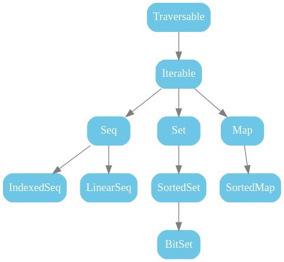
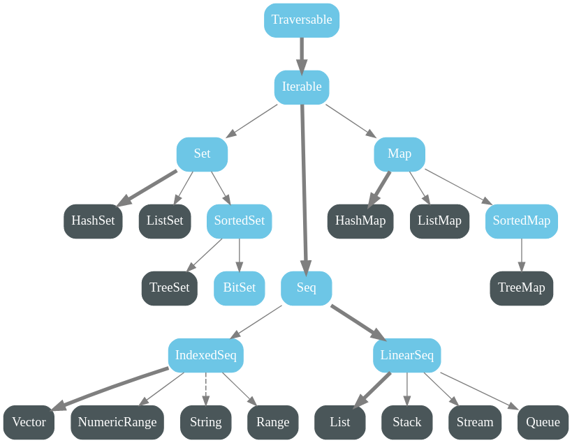
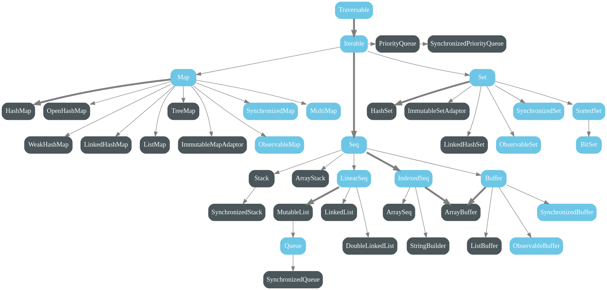

# Collections: 1
* library / package / class which can be imported.
* powerful and rich set collections: ArrayBuffer, List, Set, Map....


1. collection is just a class, which someone already defined.
2. some collections:
   1. Lazy:  (memory is assigned only when you access it. ex.: Range)
   2. strict:  when a var is defined it actually occupies memory in RAM
3. collection can be of two types: mutable and immutable.

The following figure shows all collections in package scala.collection. <br>
These are all high-level abstract classes or traits, which generally have <br>
mutable as well as immutable implementations.


<br>

* Traversable: Traverse through collection. list(1,2,3,4,5....) , forward, backword traversal
* Iterable: Access element one by one.
* Seq: seq is colln of ordered element . Array(1,2,3) index: 0,1,2
* set: have some uniques elements and have no duplicates.
* map: key value pair. map {"Name" => "Dell", "LOC" => "India"}

## Mutable and Immutable:
| Immutable                                                                          | Mutable                                                                           |
|------------------------------------------------------------------------------------|-----------------------------------------------------------------------------------|
| we CAN NOT change the contents of collections.                                     | we can change teh contents of collections.                                        |
| can be var or val                                                                  | can be var or val                                                                 |
| The following figure shows all collections in package `scala.collection.immutable.` | the following figure shows all collections in _`package scala.collection.mutable`_ |
|                                                                 |                                                            |
| i.e: List                                                                          | i.e: ArrayBuffer, seq                                                             |
|                                                                                    |                                                                                   |
### Interview Qn: Diff b/w HashSet and Hashmap
## Practicals:
### Mutables Collection:  `import scala.collection.mutable._`
1. val:
```scala
scala> val x = scala.collection.mutable.ArrayBuffer(2,4,6,8)
val x: scala.collection.mutable.ArrayBuffer[Int] = ArrayBuffer(2, 4, 6, 8)
                                                                                                                                                                                                                   
scala> x += 10
val res0: scala.collection.mutable.ArrayBuffer[Int] = ArrayBuffer(2, 4, 6, 8, 10)
//! Note: we added new element 1-, bcz it it mutable, if it had been immutable you couldn't do it.

scala> x.map(i => i + 1)
val res1: scala.collection.mutable.ArrayBuffer[Int] = ArrayBuffer(3, 5, 7, 9, 11)

scala> x.map(i => i + 1)

// can not reassign to val
scala> x = x.map(i => i + 1)
-- [E052] Type Error: ---------------------------------------------------------------------------------------------------------------------------------------------------------------------------------------------
1 |x = x.map(i => i + 1)
|^^^^^^^^^^^^^^^^^^^^^
|Reassignment to val x

longer explanation available when compiling with `-explain`
1 error found
```
2. if var:
```scala
scala> var x = scala.collection.mutable.ArrayBuffer(2,4,6,8)
var x: scala.collection.mutable.ArrayBuffer[Int] = ArrayBuffer(2, 4, 6, 8)
                                                                                                                                                                                                                   
scala> x += 10
val res2: scala.collection.mutable.ArrayBuffer[Int] = ArrayBuffer(2, 4, 6, 8, 10)

// we can reassign
scala> x = x.map(i => i + 1)
x: scala.collection.mutable.ArrayBuffer[Int] = ArrayBuffer(3, 5, 7, 9, 11)
```

### Immutables Collection: `import scala.collection.immutable._`
1. val
```scala
                                                                                                                                                                                                                   
scala> val x = scala.collection.immutable.List(2,4,6,8)
val x: List[Int] = List(2, 4, 6, 8)
//since list is immutable we can't add an element bcz += is an operator(behind the scenes it is actually a method) to add new elements.
// is not available in scala.collection.immutable
// += is defined only in scala.collection.mutable
scala> x += 10
-- [E008] Not Found Error: ----------------------------------------------------------------------------------------------------------------------------------------------------------------------------------------
1 |x += 10
  |^^^^
  |value += is not a member of List[Int] - did you mean x.!=?
1 error found
```
But what if we still want to add element: add into new list, can't do it in the same list.
```scala
scala> val y = x :+ 10
val y: List[Int] = List(2, 4, 6, 8, 10)
                                                                                                                                                                                                                   
scala> x
val res3: List[Int] = List(2, 4, 6, 8)
                                                                                                                                                                                                                   
scala> y
val res4: List[Int] = List(2, 4, 6, 8, 10)
          
//no reassignment is allowed since it is declared val not var
scala> x = x.map(i => i+1)
-- [E052] Type Error: ---------------------------------------------------------------------------------------------------------------------------------------------------------------------------------------------
1 |x = x.map(i => i+1)
  |^^^^^^^^^^^^^^^^^^^
  |Reassignment to val x

longer explanation available when compiling with `-explain`
1 error found

scala> var z = x.map(i => i + 1)
var z: List[Int] = List(3, 5, 7, 9)

```
2. var
```scala
                                                                                                                                                                                                                   
scala> var x = scala.collection.immutable.List(2,4,6,8)
var x: List[Int] = List(2, 4, 6, 8)

scala> var y = x:+ 10
var y: List[Int] = List(2, 4, 6, 8, 10)
                                                                                                                                                                                                                   
scala> x
val res5: List[Int] = List(2, 4, 6, 8)
                                                                                                                                                                                                                   
scala> y
val res6: List[Int] = List(2, 4, 6, 8, 10)
                                                                                                                                                                                                                   
scala> x = x.map( i => i+1 ) // this is completely changing the var value
x: List[Int] = List(3, 5, 7, 9)
                                                                                                                                                                                                                   
```


<h2 align="center"><sub>*** </sub> End <sub>***</sub></h2>
