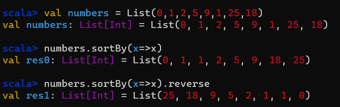
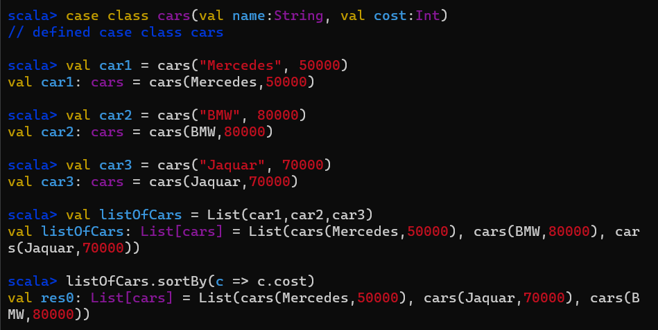
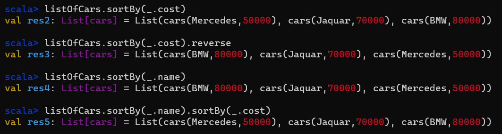
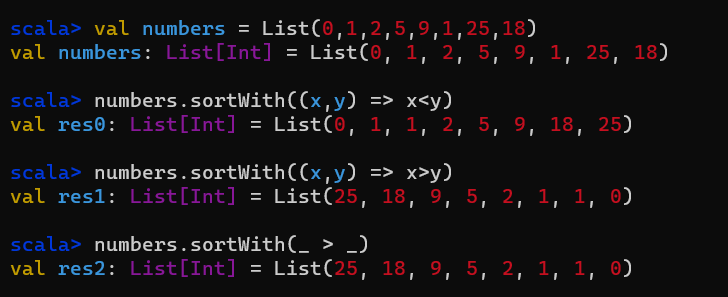
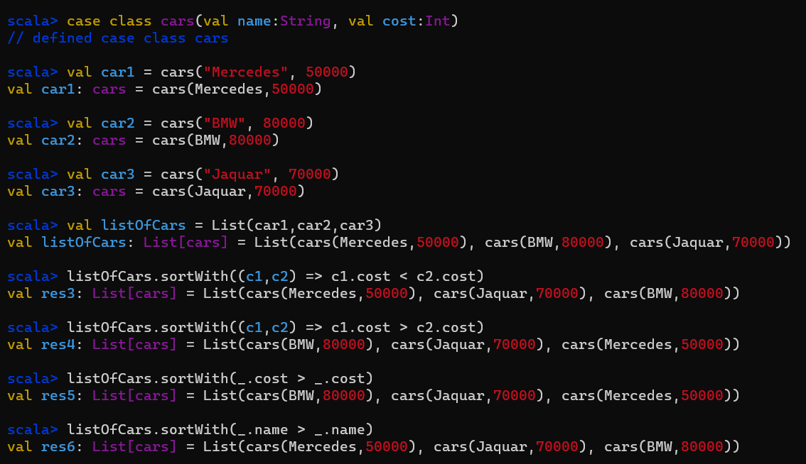
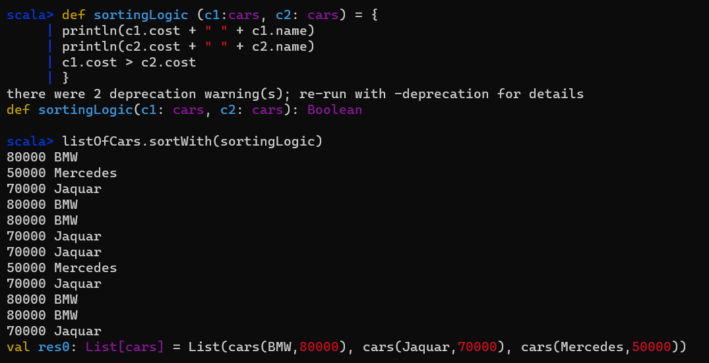
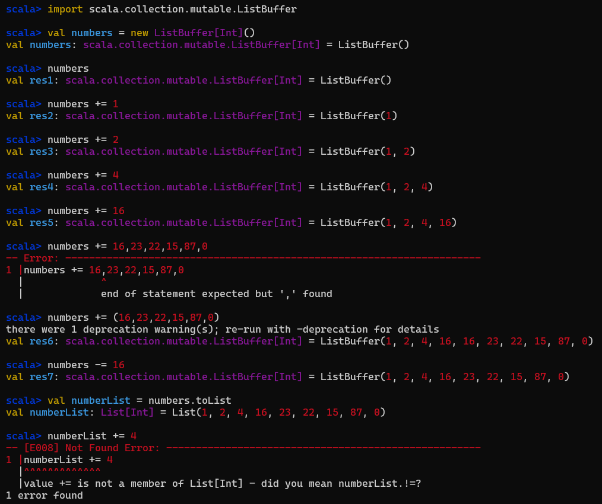

# D:19 Collection: List 1
* similar to Array {collection of elements}
* immutable (called tuples in python) (can't change contents inside a list)
* linked list is used to connect elements. `var num = List(2,4,6,8)`
* Array is continuous and use index (0,1,2,3,4....)
* Adv: linked list is fast(sequently)
* DisAdv: slow random access

1. Creating list in scala:
```scala
scala> val colors: List[String] = List("Red", "Green", "Blue", "Yellow")
val colors: List[String] = List(Red, Green, Blue, Yellow)

//No need to specify the data type. scala can interpret.
scala> val colors = List("Red", "Green", "Blue", "Yellow")
val colors: List[String] = List(Red, Green, Blue, Yellow)

//LIST OF INTEGERS
scala> val evenNumbers = List(2,4,6,8,10)
val evenNumvers: List[Int] = List(2, 4, 6, 8, 10)

//list of int and double is considered as list of double.
scala> val numbers = List(1,2,3.3,6.4, 33, 23)
val numbers: List[Double] = List(1.0, 2.0, 3.3, 6.4, 33.0, 23.0)

//list of diff dt will be of ANY type
scala> val list = List (2, 5.3, "Hello")
val list: List[Matchable] = List(2, 5.3, Hello)

//2D List:
scala> val matrix = List (
  | List(1,2,3),
  | List(4,5,6),
  | List(7,8,9,10)
    | )
val matrix: List[List[Int]] = List(List(1, 2, 3), List(4, 5, 6), List(7, 8, 9, 10))

// 2D list with int and double as its element
scala> val matrix = List (
  | List(1.1,2,3),
  | List(4,5.2,6),
  | List(7,8,9,1.0)
    | )
val matrix: List[List[Double]] = List(List(1.1, 2.0, 3.0), List(4.0, 5.2, 6.0), List(7.0, 8.0, 9.0, 1.0))

```
#### List is immutable program:
```scala
scala> val evenNumbers = List(2,4,6,8,10)
val evenNumbers: List[Int] = List(2, 4, 6, 8, 10)
                                                                                                                                                                                                                   
scala> evenNumbers(0)
val res0: Int = 2
                                                                                                                                                                                                                   
scala> evenNumbers(2)
val res1: Int = 6
                       
//can't update cuz list is immutable
scala> evenNumbers(1) = 7
-- [E008] Not Found Error: ----------------------------------------------------------------------------------------------------------------------------------------------------------------------------------------
1 |evenNumbers(1) = 7
  |^^^^^^^^^^^
  |value update is not a member of List[Int] - did you mean evenNumbers.updated?
1 error found
                                                                                                                                                                                                                   
scala> 

```
#### Array is mutable:
```scala
                                                                                                                                                                                                                   
scala> val evenNumbers = Array(2,4,6,8,10)
val evenNumbers: Array[Int] = Array(2, 4, 6, 8, 10)
                                                                                                                                                                                                                   
scala> evenNumbers(0)
val res2: Int = 2
                                                                                                                                                                                                                   
scala> evenNumbers(4)
val res3: Int = 10

scala> evenNumbers(4) = 9


//updated
scala> evenNumbers
val res6: Array[Int] = Array(2, 4, 6, 8, 9)

```
#### Another way to make list 
```scala
scala> val colors: List[String] = List("Red", "Green", "Blue", "Yellow")
val colors: List[String] = List(Red, Green, Blue, Yellow)

//using linked list way
//using :: and NIl
scala> val colors = "Red":: ("Green":: ("Blue":: ("Yellow" :: Nil)))
val colors: List[String] = List(Red, Green, Blue, Yellow)
//and
scala> val evenNumbers = 2:: (4:: (6:: (8:: (10:: Nil))))
val evenNumbers: List[Int] = List(2, 4, 6, 8, 10)

//matrix
scala> val matrix = (1:: (2:: (3::Nil))):: (4:: (5:: (6:: Nil))):: (7:: (8:: (9:: Nil)))::Nil
val matrix: List[List[Int]] = List(List(1, 2, 3), List(4, 5, 6), List(7, 8, 9))

```

## Different ways of defining a list
### Range:
```scala

scala> val numbers = List.range(1,50)
val numbers: List[Int] = List(1, 2, 3, 4, 5, 6, 7, 8, 9, 10, 11, 12, 13, 14, 15, 16, 17, 18, 19, 20, 21, 22, 23, 24, 25, 26, 27, 28, 29, 30, 31, 32, 33, 34, 35, 36, 37, 38, 39, 40, 41, 42, 43, 44, 45, 46, 47, 48, 49)

//Even
scala> val evenNumbers = List.range(2,100,2)
val evenNumbers: List[Int] = List(2, 4, 6, 8, 10, 12, 14, 16, 18, 20, 22, 24, 26, 28, 30, 32, 34, 36, 38, 40, 42, 44, 46, 48, 50, 52, 54, 56, 58, 60, 62, 64, 66, 68, 70, 72, 74, 76, 78, 80, 82, 84, 86, 88, 90, 92, 94, 96, 98)
      
//Odd 
scala> val evenNumbers = List.range(1,100,2)
val evenNumbers: List[Int] = List(1, 3, 5, 7, 9, 11, 13, 15, 17, 19, 21, 23, 25, 27, 29, 31, 33, 35, 37, 39, 41, 43, 45, 47, 49, 51, 53, 55, 57, 59, 61, 63, 65, 67, 69, 71, 73, 75, 77, 79, 81, 83, 85, 87, 89, 91, 93, 95, 97, 99)

```

```scala
//converted to list
scala> val oddNumbers = (1 to 100 by 2).toList
val oddNumbers: List[Int] = List(1, 3, 5, 7, 9, 11, 13, 15, 17, 19, 21, 23, 25, 27, 29, 31, 33, 35, 37, 39, 41, 43, 45, 47, 49, 51, 53, 55, 57, 59, 61, 63, 65, 67, 69, 71, 73, 75, 77, 79, 81, 83, 85, 87, 89, 91, 93, 95, 97, 99)
```
### Simple operations on List:

```scala
scala> val colors: List[String] = List("Red", "Green", "Blue", "Yellow")
val colors: List[String] = List(Red, Green, Blue, Yellow)

//for head of the linked list
scala> colors.head
val res7: String = Red
                             
//for tail: other than head
scala> colors.tail
val res8: List[String] = List(Green, Blue, Yellow)
          
//creating empty list
scala> val numbers = Nil
val numbers: scala.collection.immutable.Nil.type = List()
                     
//to check empty
scala> numbers.isEmpty
val res9: Boolean = true
                
scala> colors.isEmpty
val res10: Boolean = false

// to check size 
scala> colors.size
val res11: Int = 4

//size of the list
scala> numbers.size
val res12: Int = 0

//convert list into string
scala> val availablecolors = colors.mkString(", ")
val availablecolors: String = Red, Green, Blue, Yellow


//with prefix and postfix
scala> val availablecolors = colors.mkString("we are having these colors: ", ", ", " only!!    Please pick among these")
val availablecolors: String = we are having these colors: Red, Green, Blue, Yellow only!!    Please pick among these

```

```scala
scala> val colors: List[String] = List("Red", "Green", "Blue", "Yellow")
val colors: List[String] = List(Red, Green, Blue, Yellow)
                                                                                                                                                                                                                   
//Add new color into colors
//can't bcz of val 
scala> colors = colors:+ "Orange"
-- [E052] Type Error: ---------------------------------------------------------------------------------------------------------------------------------------------------------------------------------------------
1 |colors = colors:+ "Orange"
  |^^^^^^^^^^^^^^^^^^^^^^^^^^
  |Reassignment to val colors

longer explanation available when compiling with `-explain`
1 error found
  
//reassignment allowed bcz it is declared var not val
scala> var colors: List[String] = List("Red", "Green", "Blue", "Yellow")
var colors: List[String] = List(Red, Green, Blue, Yellow)
       
//Addint an element in var reassignment happens fully change
scala> colors = colors:+ "Orange"
colors: List[String] = List(Red, Green, Blue, Yellow, Orange)

scala> colors = colors:+ "Violet"
colors: List[String] = List(Red, Green, Blue, Yellow, Orange, Violet)

//adding element to the front
scala> colors = "Violet":: colors
colors: List[String] = List(Violet, Red, Green, Blue, Yellow, Orange, Violet)

  
//to show distinct items in the list: Do not add or delete from teh list
  // it just create a new list with distinct items
scala> colors = colors.distinct
colors: List[String] = List(Violet, Red, Green, Blue, Yellow, Orange)

```
### iterate over list
```scala
//in old languages
scala> for (color <- colors) println(color)
Violet
Red
Green
Blue
Yellow
Orange

//in scala: use fn programming and foreach loop
scala> colors.foreach(x => println(x))
Violet
Red
Green
Blue
Yellow
Orange

//can use underscore
scala> colors.foreach(println(_))
Violet
Red
Green
Blue
Yellow
Orange

// can remove everything
scala> colors.foreach(println)
Violet
Red
Green
Blue
Yellow
Orange

//
scala> val numbers = List(1,2,3.3,6.4, 33, 23)
val numbers: List[Double] = List(1.0, 2.0, 3.3, 6.4, 33.0, 23.0)

scala> numbers.foreach(x => println(x * 2))
2.0
4.0
6.6
12.8
66.0
46.0

```
### list as immutable dt
```scala
                                                                                                                                                                                                                   
scala> var colors: List[String] = List("Red", "Green", "Blue", "Yellow")
var colors: List[String] = List(Red, Green, Blue, Yellow)
                                                                                                                                                                                                                   
scala> colors(2)
val res16: String = Blue
    

//can't update even if its var
scala> colors(2) = "Red"
-- [E008] Not Found Error: ----------------------------------------------------------------------------------------------------------------------------------------------------------------------------------------
1 |colors(2) = "Red"
  |^^^^^^
  |value update is not a member of List[String] - did you mean List[String].updated?
1 error found
                                                                                                                                                                                                                   
scala> 

```
```scala
//some fns
//colors with length == 3
scala> var colorsWithLength3 = colors.filter(x => x.length == 3)
var colorsWithLength3: List[String] = List(Red)
                         
//colors which is green
scala> var colorsWithLength3 = colors.filter(x => x == "Green")
var colorsWithLength3: List[String] = List(Green)
                       
//colors which has "e" in it
scala> var colorsWithLength3 = colors.filter(x => x.contains("e"))
var colorsWithLength3: List[String] = List(Red, Green, Blue, Yellow)
                                                                                                                                                                                                                   
//colors having length greater than, equal to 4
scala> var colorsWithLength3 = colors.filter(x => x.length >= 4)
var colorsWithLength3: List[String] = List(Green, Blue, Yellow)

  //to check if a color is in colors or not???
scala> var colorshavingBlue = colorsWithLength3.exists(x => x =="Violet")
var colorshavingBlue: Boolean = false

scala> var colorshavingBlue = colorsWithLength3.exists(x => x =="Grey")
var colorshavingBlue: Boolean = false

scala>

```


<h2 align="center"><sub>*** </sub> End <sub>***</sub></h2>

# D:20 Collection: List 2
### Fill: creating list with same data
```scala
scala> val colors = List.fill(5) ("Red")
val colors: List[String] = List(Red, Red, Red, Red, Red)
                                                                                
scala> val colors = List.fill(5) (5.65)
val colors: List[Double] = List(5.65, 5.65, 5.65, 5.65, 5.65)
```

### tabulate: you can apply some fn to generate elements list:
work on index on following way:

```scala
scala> val numbers = List.tabulate(5) (x => x * 2)
val numbers: List[Int] = List(0, 2, 4, 6, 8)
                                                                                
scala> val square = List.tabulate(5) (x => x * x)
val square: List[Int] = List(0, 1, 4, 9, 16)
     
```

#### 3 * 3 matrix multiplication. 
| Rows\Column | 0   | 1   | 2   |
|-------------|-----|-----|-----|
| 0           | 0   | 0   | 0   |
| 1           | 0   | 1   | 2   |
| 2           | 0   | 2   | 4   |
```scala
scala> val matrix = List.tabulate(3,3) ((r,c) => r * c)
val matrix: List[List[Int]] = List(List(0, 0, 0), List(0, 1, 2), List(0, 2, 4))
```

### Reverse: reverse the order of the list
```scala
                                                                                
scala> val numbers = List(0,1,2,4,5,6,8,10,99)
val numbers: List[Int] = List(0, 1, 2, 4, 5, 6, 8, 10, 99)
                                                                                
scala> numbers.reverse
val res0: List[Int] = List(99, 10, 8, 6, 5, 4, 2, 1, 0)
  
//Note: contents of list will be change, list is immutable
scala> numbers
val res1: List[Int] = List(0, 1, 2, 4, 5, 6, 8, 10, 99)
                                                          
//can assigned as a new var though.
scala> val reversenumbers = numbers.reverse
val reversenumbers: List[Int] = List(99, 10, 8, 6, 5, 4, 2, 1, 0)
                                                                                
scala> reversenumbers
val res2: List[Int] = List(99, 10, 8, 6, 5, 4, 2, 1, 0)

//to sort in ascending order
scala> numbers.sorted
val res3: List[Int] = List(0, 1, 2, 4, 5, 6, 8, 10, 99)

//to sort in descending order
scala> numbers.sorted(Ordering.Int.reverse)
val res4: List[Int] = List(99, 10, 8, 6, 5, 4, 2, 1, 0)

```
### SortBy fn explore....? check on internet....

```scala

scala> val numbers = List(0,1,2,5,9,1,25,18)
val numbers: List[Int] = List(0, 1, 2, 5, 9, 1, 25, 18)

scala> numbers.sortBy(x=>x)
val res0: List[Int] = List(0, 1, 1, 2, 5, 9, 18, 25)

scala> numbers.sortBy(x=>x).reverse
val res1: List[Int] = List(25, 18, 9, 5, 2, 1, 1, 0)
```

### complex sortBy ex:

```scala
scala> case class cars(val name:String, val cost:Int)
// defined case class cars

scala> val car1 = cars("Mercedes", 50000)
val car1: cars = cars(Mercedes,50000)

scala> val car2 = cars("BMW", 80000)
val car2: cars = cars(BMW,80000)

scala> val car3 = cars("Jaquar", 70000)
val car3: cars = cars(Jaquar,70000)

//making list of all cars
scala> val listOfCars = List(car1,car2,car3)
val listOfCars: List[cars] = List(cars(Mercedes,50000), cars(BMW,80000), cars(Jaquar,70000))

//sort by cost
scala> listOfCars.sortBy(c => c.cost)
val res0: List[cars] = List(cars(Mercedes,50000), cars(Jaquar,70000), cars(BMW,80000))

//sort by cost in reverse
scala> listOfCars.sortBy(c => c.cost).reverse
val res1: List[cars] = List(cars(BMW,80000), cars(Jaquar,70000), cars(Mercedes,50000))

//shorthand notation
scala> listOfCars.sortBy(_.cost)
val res2: List[cars] = List(cars(Mercedes,50000), cars(Jaquar,70000), cars(BMW,80000))

scala> listOfCars.sortBy(_.cost).reverse
val res3: List[cars] = List(cars(BMW,80000), cars(Jaquar,70000), cars(Mercedes,50000))

scala> listOfCars.sortBy(_.name)
val res4: List[cars] = List(cars(BMW,80000), cars(Jaquar,70000), cars(Mercedes,50000))

scala> listOfCars.sortBy(_.name).sortBy(_.cost)
val res5: List[cars] = List(cars(Mercedes,50000), cars(Jaquar,70000), cars(BMW,80000))

scala>

```


### sortwith

```scala
scala> val numbers = List(0,1,2,5,9,1,25,18)
val numbers: List[Int] = List(0, 1, 2, 5, 9, 1, 25, 18)

//Ascending order
scala> numbers.sortWith((x,y) => x<y)
val res0: List[Int] = List(0, 1, 1, 2, 5, 9, 18, 25)

//Descending order
scala> numbers.sortWith((x,y) => x>y)
val res1: List[Int] = List(25, 18, 9, 5, 2, 1, 1, 0)


//shorthand notation
scala> numbers.sortWith(_ > _)
val res2: List[Int] = List(25, 18, 9, 5, 2, 1, 1, 0)
```
### Complex

```scala
scala> case class cars(val name:String, val cost:Int)
// defined case class cars

scala> val car1 = cars("Mercedes", 50000)
val car1: cars = cars(Mercedes,50000)

scala> val car2 = cars("BMW", 80000)
val car2: cars = cars(BMW,80000)

scala> val car3 = cars("Jaquar", 70000)
val car3: cars = cars(Jaquar,70000)

scala> val listOfCars = List(car1,car2,car3)
val listOfCars: List[cars] = List(cars(Mercedes,50000), cars(BMW,80000), cars(Jaquar,70000))

//sort with price
scala> listOfCars.sortWith((c1,c2) => c1.cost < c2.cost)
val res3: List[cars] = List(cars(Mercedes,50000), cars(Jaquar,70000), cars(BMW,80000))

//sort with price descending order
scala> listOfCars.sortWith((c1,c2) => c1.cost > c2.cost)
val res4: List[cars] = List(cars(BMW,80000), cars(Jaquar,70000), cars(Mercedes,50000))

//shorthand
scala> listOfCars.sortWith(_.cost > _.cost)
val res5: List[cars] = List(cars(BMW,80000), cars(Jaquar,70000), cars(Mercedes,50000))

scala> listOfCars.sortWith(_.name > _.name)
val res6: List[cars] = List(cars(Mercedes,50000), cars(Jaquar,70000), cars(BMW,80000))
```
### More Complex

```scala
scala> def sortingLogic (c1:cars, c2: cars) = {
  | println(c1.cost + " " + c1.name)
  | println(c2.cost + " " + c2.name)
  | c1.cost > c2.cost
  | }
there were 2 deprecation warning(s); re-run with -deprecation for details
def sortingLogic(c1: cars, c2: cars): Boolean

scala> listOfCars.sortWith(sortingLogic)
80000 BMW
  50000 Mercedes
  70000 Jaquar
  80000 BMW
  80000 BMW
  70000 Jaquar
  70000 Jaquar
  50000 Mercedes
  70000 Jaquar
  80000 BMW
  80000 BMW
  70000 Jaquar
val res0: List[cars] = List(cars(BMW,80000), cars(Jaquar,70000), cars(Mercedes,50000))

```
## Mutalbe List Buffer:
1. import: `import scala.collection.mutable.ListBuffer`

```scala

scala> import scala.collection.mutable.ListBuffer

//2. create an empty ListBuffer of Int
scala> val numbers = new ListBuffer[Int]()
val numbers: scala.collection.mutable.ListBuffer[Int] = ListBuffer()

scala> numbers
val res1: scala.collection.mutable.ListBuffer[Int] = ListBuffer()

//adding 
scala> numbers += 1
val res2: scala.collection.mutable.ListBuffer[Int] = ListBuffer(1)

scala> numbers += 2
val res3: scala.collection.mutable.ListBuffer[Int] = ListBuffer(1, 2)

scala> numbers += 4
val res4: scala.collection.mutable.ListBuffer[Int] = ListBuffer(1, 2, 4)

scala> numbers += 16
val res5: scala.collection.mutable.ListBuffer[Int] = ListBuffer(1, 2, 4, 16)

//adding more than one element failed so use bracket
scala> numbers += 16,23,22,15,87,0
-- Error: ----------------------------------------------------------------------
1 |numbers += 16,23,22,15,87,0
  |             ^
  |             end of statement expected but ',' found

//adding more than one element using bracket
scala> numbers += (16,23,22,15,87,0)
there were 1 deprecation warning(s); re-run with -deprecation for details
val res6: scala.collection.mutable.ListBuffer[Int] = ListBuffer(1, 2, 4, 16, 16, 23, 22, 15, 87, 0)

//removing 16 form the listbuffer
scala> numbers -= 16
val res7: scala.collection.mutable.ListBuffer[Int] = ListBuffer(1, 2, 4, 16, 23, 22, 15, 87, 0)

//converting to list
scala> val numberList = numbers.toList
val numberList: List[Int] = List(1, 2, 4, 16, 23, 22, 15, 87, 0)

//can't add items in list like list buffer
scala> numberList += 4
-- [E008] Not Found Error: -----------------------------------------------------
1 |numberList += 4
  |^^^^^^^^^^^^^
  |value += is not a member of List[Int] - did you mean numberList.!=?
1 error found

```
* apply map to list buffer
```scala
scala> numbers.map(x => x*x)
val res8: scala.collection.mutable.ListBuffer[Int] = ListBuffer(1, 4, 16, 256, 529, 484, 225, 7569, 0)

scala> numbers
val res9: scala.collection.mutable.ListBuffer[Int] = ListBuffer(1, 2, 4, 16, 23, 22, 15, 87, 0)

scala>
```
<h2 align="center"><sub>*** </sub> End <sub>***</sub></h2>
