# Day 21:: Collection: Sets

* collection of pairwise elements
* can be immutable or mutable
* immutable: by default
* mutable: `import scala.collection.mutable.Set`
* always have unique element.
* won't preserve the sequence. just like dict in python

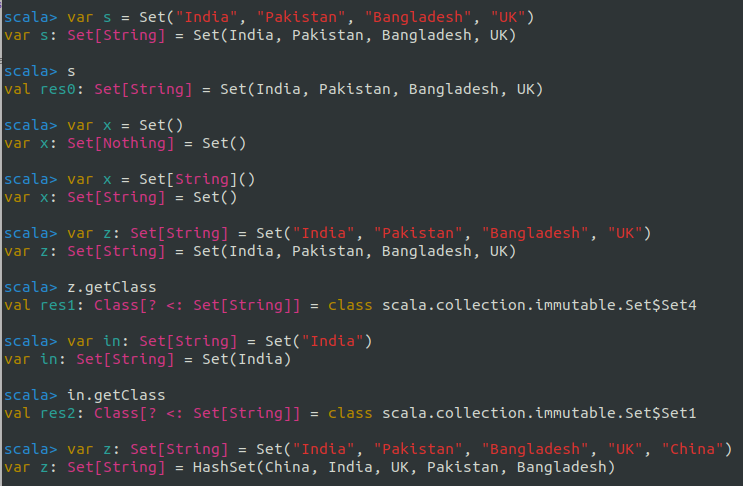

```scala
//1. create immutable set
scala> var s = Set("India", "Pakistan", "Bangladesh", "UK")
var s: Set[String] = Set(India, Pakistan, Bangladesh, UK)
                                                                                
scala> s
val res0: Set[String] = Set(India, Pakistan, Bangladesh, UK)
       
//empty set of no type
scala> var x = Set()
var x: Set[Nothing] = Set()

//empty set of string type
scala> var x = Set[String]()
var x: Set[String] = Set()

//can be also done like that
scala> var z: Set[String] = Set("India", "Pakistan", "Bangladesh", "UK")
var z: Set[String] = Set(India, Pakistan, Bangladesh, UK)
                            
// to get class of the set : set 4 in the end represent element in the set
scala> z.getClass
val res1: Class[? <: Set[String]] = class scala.collection.immutable.Set$Set4
                                                                                
scala> var in: Set[String] = Set("India")
var in: Set[String] = Set(India)
                                                                                
scala> in.getClass
val res2: Class[? <: Set[String]] = class scala.collection.immutable.Set$Set1
                         
// when the elements are more than 4 then it automatically  gives Hashset
scala> var z: Set[String] = Set("India", "Pakistan", "Bangladesh", "UK", "China")
var z: Set[String] = HashSet(China, India, UK, Pakistan, Bangladesh)

scala> var zzz: Set[String] = Set("India", "Pakistan", "Bangladesh", "UK", "China", "Russia", "Japan", "North Korea", "Maldeves")
var zzz: Set[String] = HashSet(Maldeves, Japan, Russia, China, India, UK, Pakistan, Bangladesh, North Korea)

scala> zzz.getClass
val res0: Class[? <: Set[String]] = class scala.collection.immutable.HashSet

scala>

```

## Mutable Set

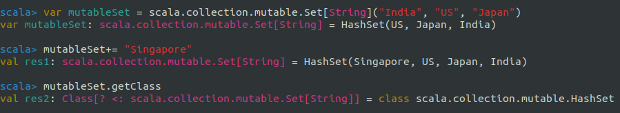

```scala
//creating mutable hashset
scala> var mutableSet = scala.collection.mutable.Set[String]("India", "US", "Japan")
var mutableSet: scala.collection.mutable.Set[String] = HashSet(US, Japan, India)
                          
//adding an element
scala> mutableSet+= "Singapore"
val res1: scala.collection.mutable.Set[String] = HashSet(Singapore, US, Japan, India)
                   
// get the class for which object is created while creating set
scala> mutableSet.getClass
val res2: Class[? <: scala.collection.mutable.Set[String]] = class scala.collection.mutable.HashSet

```

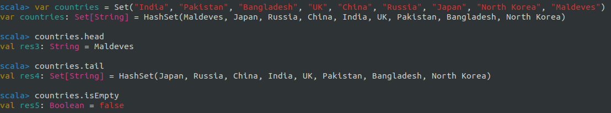

```scala
//create an immutable set
scala> var countries = Set("India", "Pakistan", "Bangladesh", "UK", "China", "Russia", "Japan", "North Korea", "Maldeves")
var countries: Set[String] = HashSet(Maldeves, Japan, Russia, China, India, UK, Pakistan, Bangladesh, North Korea)
                     
//first element
scala> countries.head
val res3: String = Maldeves
               
//rest element
scala> countries.tail
val res4: Set[String] = HashSet(Japan, Russia, China, India, UK, Pakistan, Bangladesh, North Korea)
              
//check if empty
scala> countries.isEmpty
val res5: Boolean = false
                                                                                                                                                                                                                   
```

### combine 2 sets into one using ++ method

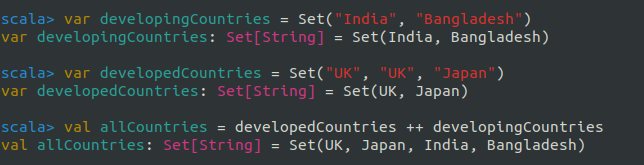

```scala

scala> var developingCountries = Set("India", "Bangladesh")
var developingCountries: Set[String] = Set(India, Bangladesh)
                                                                                     
scala> var developedCountries = Set("UK", "UK", "Japan")
var developedCountries: Set[String] = Set(UK, Japan)
                                                                                     
scala> val allCountries = developedCountries ++ developingCountries
val allCountries: Set[String] = Set(UK, Japan, India, Bangladesh)

```

## Part 4: simple functions on set

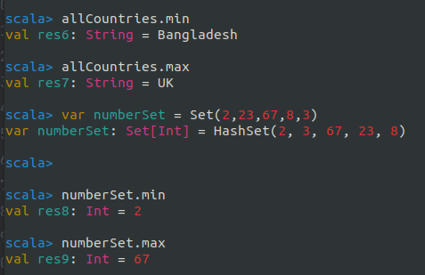

```scala
//find min
scala> allCountries.min
val res6: String = Bangladesh
                                                                                     
//find max
scala> allCountries.max
val res7: String = UK
                                                                                     
scala> var numberSet = Set(2,23,67,8,3)
var numberSet: Set[Int] = HashSet(2, 3, 67, 23, 8)
                                                                                     
//find min
scala> numberSet.min
val res8: Int = 2

//find max
scala> numberSet.max
val res9: Int = 67

```

### working with duplicates

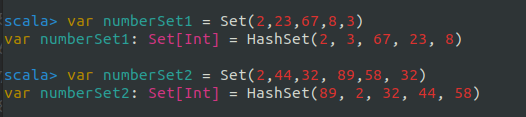

```scala
scala> var numberSet1 = Set(2,23,67,8,3)
var numberSet1: Set[Int] = HashSet(2, 3, 67, 23, 8)
                        
//here 32 is added twice but second one is ignored.
scala> var numberSet2 = Set(2,44,32, 89,58, 32)
var numberSet2: Set[Int] = HashSet(89, 2, 32, 44, 58)

```

Note:

1. 32 is two times, but set is collection of unique elements so it ignores the duplicate value.
2. sequence is not preserved.As data in set is not stored as per index, but it is stored as pair wise (i.e. which elemnt comes behind which element)
3. HashSet take 5.5 times more memory than ArrayList for storing same number of elements.

**Pairwise Adv and DisAdv**:

* Adv: iteration (eg for loop) operation s more fast for sets as compared to list
* DisAdv: Random Retrival of elements for set si slower than list (numberSet[1021]: Accessing 1021th element from a set)

### Union and intersection

1. Common element:

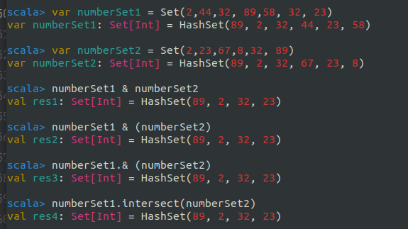

```scala
scala> var numberSet1 = Set(2,44,32, 89,58, 32, 23)
var numberSet1: Set[Int] = HashSet(89, 2, 32, 44, 23, 58)
                                                                                     
scala> var numberSet2 = Set(2,23,67,8,32, 89)
var numberSet2: Set[Int] = HashSet(89, 2, 32, 67, 23, 8)
    
//all following : doing the same thing:: finding common in 2 set
scala> numberSet1 & numberSet2
val res1: Set[Int] = HashSet(89, 2, 32, 23)
                                                                                     
scala> numberSet1 & (numberSet2)
val res2: Set[Int] = HashSet(89, 2, 32, 23)
                                                                                     
scala> numberSet1.& (numberSet2)
val res3: Set[Int] = HashSet(89, 2, 32, 23)
                                                                                     
scala> numberSet1.intersect(numberSet2)
val res4: Set[Int] = HashSet(89, 2, 32, 23)

```

2. Union:

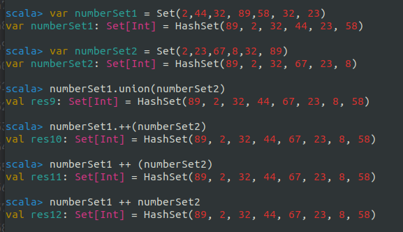

```scala
scala> var numberSet1 = Set(2,44,32, 89,58, 32, 23)
var numberSet1: Set[Int] = HashSet(89, 2, 32, 44, 23, 58)
                                                                                     
scala> var numberSet2 = Set(2,23,67,8,32, 89)
var numberSet2: Set[Int] = HashSet(89, 2, 32, 67, 23, 8)

//all following : doing the same thing:: finding union of 2 set
scala> numberSet1.union(numberSet2)
val res9: Set[Int] = HashSet(89, 2, 32, 44, 67, 23, 8, 58)
                                                                                     
scala> numberSet1.++(numberSet2)
val res10: Set[Int] = HashSet(89, 2, 32, 44, 67, 23, 8, 58)
                                                                                     
scala> numberSet1 ++ (numberSet2)
val res11: Set[Int] = HashSet(89, 2, 32, 44, 67, 23, 8, 58)
                                                                                     
scala> numberSet1 ++ numberSet2
val res12: Set[Int] = HashSet(89, 2, 32, 44, 67, 23, 8, 58)

```

### Mutable Sets

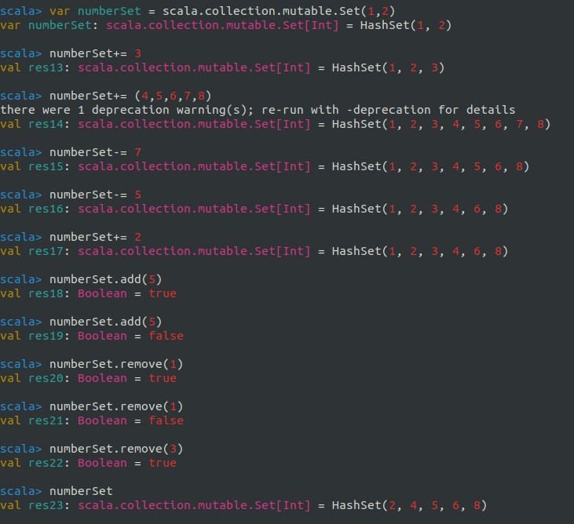

```scala
//creating mutable set
scala> var numberSet = scala.collection.mutable.Set(1,2)
var numberSet: scala.collection.mutable.Set[Int] = HashSet(1, 2)
                      
//adding elements
scala> numberSet+= 3
val res13: scala.collection.mutable.Set[Int] = HashSet(1, 2, 3)
                                                                                     
scala> numberSet+= (4,5,6,7,8)
there were 1 deprecation warning(s); re-run with -deprecation for details
val res14: scala.collection.mutable.Set[Int] = HashSet(1, 2, 3, 4, 5, 6, 7, 8)
                 
//removing elements
scala> numberSet-= 7
val res15: scala.collection.mutable.Set[Int] = HashSet(1, 2, 3, 4, 5, 6, 8)
                                                                                     
scala> numberSet-= 5
val res16: scala.collection.mutable.Set[Int] = HashSet(1, 2, 3, 4, 6, 8)
                   
//if element is already present then nothing happens
scala> numberSet+= 2
val res17: scala.collection.mutable.Set[Int] = HashSet(1, 2, 3, 4, 6, 8)
                                                    
//add method: tell you if the element(new) is added or not, 
//if the same no. is already in set then it will show false
scala> numberSet.add(5)
val res18: Boolean = true
                                                                                     
scala> numberSet.add(5)
val res19: Boolean = false

//same goes for remove method
scala> numberSet.remove(1)
val res20: Boolean = true

scala> numberSet.remove(1)
val res21: Boolean = false

scala> numberSet.remove(3)
val res22: Boolean = true

scala> numberSet
val res23: scala.collection.mutable.Set[Int] = HashSet(2, 4, 5, 6, 8)


```

### Contains

contains check if a particular element is present in the set or not

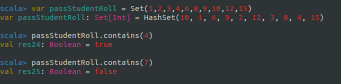

```scala
scala> var passStudentRoll = Set(1,2,3,4,6,8,9,10,12,15)
var passStudentRoll: Set[Int] = HashSet(10, 1, 6, 9, 2, 12, 3, 8, 4, 15)
                                                                                                                                                                                                                   
scala> passStudentRoll.contains(4)
val res24: Boolean = true
                                                                                                                                                                                                                   
scala> passStudentRoll.contains(7)
val res25: Boolean = false

```

All the methods set contains:
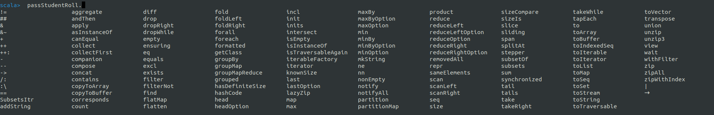

```scala
var passStudentRoll = Set(1,2,3,4,6,8,9,10,12,15)
var passStudentRoll: Set[Int] = HashSet(10, 1, 6, 9, 2, 12, 3, 8, 4, 15)
                                                                                                                                                                                                                   
scala> passStudentRoll.
!=                   aggregate            diff                 fold                 incl                 maxBy                product              sizeCompare          takeWhile            toVector
##                   andThen              drop                 foldLeft             init                 maxByOption          reduce               sizeIs               tapEach              transpose
&                    apply                dropRight            foldRight            inits                maxOption            reduceLeft           slice                to                   union
&~                   asInstanceOf         dropWhile            forall               intersect            min                  reduceLeftOption     sliding              toArray              unzip
+                    canEqual             empty                foreach              isEmpty              minBy                reduceOption         span                 toBuffer             unzip3
++                   collect              ensuring             formatted            isInstanceOf         minByOption          reduceRight          splitAt              toIndexedSeq         view
++:                  collectFirst         eq                   getClass             isTraversableAgain   minOption            reduceRightOption    stepper              toIterable           wait
-                    companion            equals               groupBy              iterableFactory      mkString             removedAll           subsetOf             toIterator           withFilter
--                   compose              excl                 groupMap             iterator             ne                   repr                 subsets              toList               zip
->                   concat               exists               groupMapReduce       knownSize            nn                   sameElements         sum                  toMap                zipAll
/:                   contains             filter               grouped              last                 nonEmpty             scan                 synchronized         toSeq                zipWithIndex
:\                   copyToArray          filterNot            hasDefiniteSize      lastOption           notify               scanLeft             tail                 toSet                |
==                   copyToBuffer         find                 hashCode             lazyZip              notifyAll            scanRight            tails                toStream             →
SubsetsItr           corresponds          flatMap              head                 map                  partition            seq                  take                 toString
addString            count                flatten              headOption           max                  partitionMap         size                 takeRight            toTraversable
```

### hashset and linkedhashSet

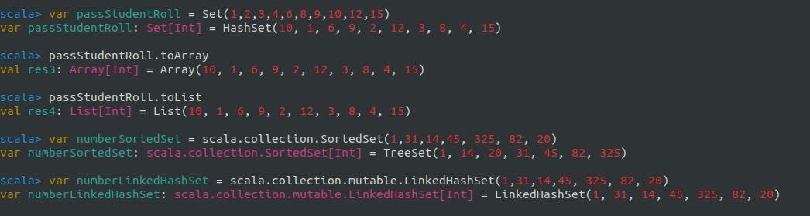

```scala
scala> var passStudentRoll = Set(1,2,3,4,6,8,9,10,12,15)
^[[Avar passStudentRoll: Set[Int] = HashSet(10, 1, 6, 9, 2, 12, 3, 8, 4, 15)
                                                                                                                                                                                                                   
//converted to Array                                                                                                                                                                                                          
scala> passStudentRoll.toArray
val res1: Array[Int] = Array(10, 1, 6, 9, 2, 12, 3, 8, 4, 15)

//converted to List                                                                                                                                                                                                      
scala> passStudentRoll.toList
val res2: List[Int] = List(10, 1, 6, 9, 2, 12, 3, 8, 4, 15)

//sorted set: Keeps the data in ascending order
scala> var numberSortedSet = scala.collection.SortedSet(1,31,14,45, 325, 82, 20)
var numberSortedSet: scala.collection.SortedSet[Int] = TreeSet(1, 14, 20, 31, 45, 82, 325)

//HashSet: preserves the sequence
scala> var numberLinkedHashSet = scala.collection.mutable.LinkedHashSet(1,31,14,45, 325, 82, 20)
var numberLinkedHashSet: scala.collection.mutable.LinkedHashSet[Int] = LinkedHashSet(1, 31, 14, 45, 325, 82, 20)

```

### Queue

* dequeue(): removes the first element from this queue and return it.
* dequeueFirst(p: (A) => Boolean): returns first element in the queue  
which satisfies the given predicate and removes the element from the queue

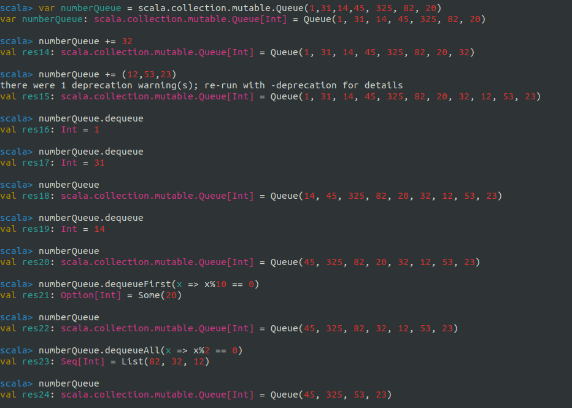

```scala
//creating a queue
scala> var numberQueue = scala.collection.mutable.Queue(1,31,14,45, 325, 82, 20)
var numberQueue: scala.collection.mutable.Queue[Int] = Queue(1, 31, 14, 45, 325, 82, 20)
                  
//adding element
scala> numberQueue += 32
val res14: scala.collection.mutable.Queue[Int] = Queue(1, 31, 14, 45, 325, 82, 20, 32)
                                                                                                                                                                                                                   
scala> numberQueue += (12,53,23)
there were 1 deprecation warning(s); re-run with -deprecation for details
val res15: scala.collection.mutable.Queue[Int] = Queue(1, 31, 14, 45, 325, 82, 20, 32, 12, 53, 23)
                
//removing element
scala> numberQueue.dequeue
val res16: Int = 1
                                                                                                                                                                                                                   
scala> numberQueue.dequeue
val res17: Int = 31
                                                                                                                                                                                                                   
scala> numberQueue
val res18: scala.collection.mutable.Queue[Int] = Queue(14, 45, 325, 82, 20, 32, 12, 53, 23)
                                                                                                                                                                                                                   
scala> numberQueue.dequeue
val res19: Int = 14
                                                                                                                                                                                                                   
scala> numberQueue
val res20: scala.collection.mutable.Queue[Int] = Queue(45, 325, 82, 20, 32, 12, 53, 23)
                  
//removing first element which satisfies the condiion
scala> numberQueue.dequeueFirst(x => x%10 == 0)
val res21: Option[Int] = Some(20)
                                                                                                                                                                                                                   
scala> numberQueue
val res22: scala.collection.mutable.Queue[Int] = Queue(45, 325, 82, 32, 12, 53, 23)

//removing all elements which satisfies the condiion
scala> numberQueue.dequeueAll(x => x%2 == 0)
val res23: Seq[Int] = List(82, 32, 12)
                                                                                                                                                                                                                   
scala> numberQueue
val res24: scala.collection.mutable.Queue[Int] = Queue(45, 325, 53, 23)

//shorthand notation
scala> numberQueue.dequeueAll(_%3 == 0)
val res25: Seq[Int] = List(45)

scala> numberQueue
val res26: scala.collection.mutable.Queue[Int] = Queue(325, 53, 23)

scala>

```

<h2 align="center"><sub>*** </sub> End <sub>***</sub></h2>
