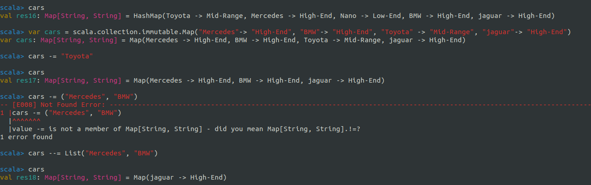

# Day 22:: Collections: Map

* `{key : Value, Key: Value, K:V,.......}`
* Key must be unique
* can be mutable as well as immutable
* mutable: `{1: "ONE", 2: "Two", 3: "Three"}` specify `scala.collection.mutable.Map`
* immutable : by default
* sequence of elements is not preserved
* in the case of duplicate key, the latest value of the key is shown and the value is overwritten.
* can have duplicate value but not keys.


```scala
//creating a map
scala> var cars = Map("Mercedes"-> "High-End", "BMW"-> "High-End", "Toyota" -> "Mid-Range", "jaguar"-> "High-End", "Nano" -> "Low-End")
var cars: Map[String, String] = HashMap(Toyota -> Mid-Range, Mercedes -> High-End, Nano -> Low-End, BMW -> High-End, jaguar -> High-End)

// trying to add duplicates as a key
scala> var cars = Map("Mercedes"-> "High-End", "BMW"-> "High-End", "Toyota" -> "Mid-Range", "jaguar"-> "High-End", "Nano" -> "Low-End", "Mercedes" -> "Low-End")
var cars: Map[String, String] = HashMap(Toyota -> Mid-Range, Mercedes -> Low-End, Nano -> Low-End, BMW -> High-End, jaguar -> High-End)

//added a new key-value pair
scala> cars += ("Suzuki" -> "Mid-End")

//now as a val
scala> val cars1 = Map("Mercedes"-> "High-End", "BMW"-> "High-End", "Toyota" -> "Mid-Range", "jaguar"-> "High-End", "Nano" -> "Low-End")
val cars1: Map[String, String] = HashMap(Toyota -> Mid-Range, Mercedes -> High-End, Nano -> Low-End, BMW -> High-End, jaguar -> High-End)

//can't add as it is declared as val
scala> cars1 += ("Suzuki" -> "Mid-End")
-- [E008] Not Found Error: -----------------------------------------------------
1 |cars1 += ("Suzuki" -> "Mid-End")
|^^^^^^^^
|value += is not a member of Map[String, String] - did you mean cars1.!=?
1 error found

```

## Mutable Map

in mutable map adding an element is not a problem in var as well as val.

### reason is

1. `+=` operator behaves differently in `scala.collection.immutable.Map` and `scala.collection.mutable.Map`
2. in immutable Map, `+=` operator (method) will return a new Map object, and new object can only be saved if the object is of type var
3. in mutable Map, `+=` method will modify the existing map object, hence it will work on both var and val.


```scala
// mutable map as var
scala> var cars3 = scala.collection.mutable.Map("Mercedes"-> "High-End", "BMW"-> "High-End", "Toyota" -> "Mid-Range", "jaguar"-> "High-End", "Nano" -> "Low-End")
var cars3: scala.collection.mutable.Map[String, String] = HashMap(Nano -> Low-End, Mercedes -> High-End, Toyota -> Mid-Range, BMW -> High-End, jaguar -> High-End)

scala> cars3 += ("Suzuki" -> "Mid-End")
val res3: scala.collection.mutable.Map[String, String] = HashMap(Nano -> Low-End, Toyota -> Mid-Range, Suzuki -> Mid-End, Mercedes -> High-End, BMW -> High-End, jaguar -> High-End)

// mutable map as var
scala> val cars2 = scala.collection.mutable.Map("Mercedes"-> "High-End", "BMW"-> "High-End", "Toyota" -> "Mid-Range", "jaguar"-> "High-End", "Nano" -> "Low-End")
val cars2: scala.collection.mutable.Map[String, String] = HashMap(Nano -> Low-End, Mercedes -> High-End, Toyota -> Mid-Range, BMW -> High-End, jaguar -> High-End)
                                                                                                                                                                                                                   
scala> cars2 += ("Suzuki" -> "Mid-End")
val res2: scala.collection.mutable.Map[String, String] = HashMap(Nano -> Low-End, Toyota -> Mid-Range, Suzuki -> Mid-End, Mercedes -> High-End, BMW -> High-End, jaguar -> High-End)

```

### some methods


```scala
scala> var cars3 = scala.collection.mutable.Map("Mercedes"-> "High-End", "BMW"-> "High-End", "Toyota" -> "Mid-Range", "jaguar"-> "High-End", "Nano" -> "Low-End")
^[[Avar cars3: scala.collection.mutable.Map[String, String] = HashMap(Nano -> Low-End, Mercedes -> High-End, Toyota -> Mid-Range, BMW -> High-End, jaguar -> High-End)
                                                                                                                                                                                                                   
scala> cars3 += ("Suzuki" -> "Mid-End")
val res0: scala.collection.mutable.Map[String, String] = HashMap(Nano -> Low-End, Toyota -> Mid-Range, Suzuki -> Mid-End, Mercedes -> High-End, BMW -> High-End, jaguar -> High-End)
 
//show all the keys
scala> cars3.keys
val res1: Iterable[String] = Set(Nano, Toyota, Suzuki, Mercedes, BMW, jaguar)

//show all the values
scala> cars3.values
val res2: Iterable[String] = Iterable(Low-End, Mid-Range, Mid-End, High-End, High-End, High-End)
                     
//check if it's empty
scala> cars3.isEmpty
val res3: Boolean = false
                                                                                                                                                                                                                   
//show the minimum alphabetically
scala> cars3.min
val res4: (String, String) = (BMW,High-End)

//show the maximum alphabetically
scala> cars3.max
val res5: (String, String) = (jaguar,High-End)

```

### EmptyMap


```scala
//create an empty map()
scala> var emptyMap = Map()
var emptyMap: Map[Nothing, Nothing] = Map()
                       
//check if its empty
scala> emptyMap.isEmpty
val res6: Boolean = true
                                                                                                                                                                                                                   
//another way of creating empty map
scala> var emptyMap: Map[String, String] = Map()
var emptyMap: Map[String, String] = Map()

//check if its empty
scala> emptyMap.isEmpty
val res7: Boolean = true

//adding a new element
scala> emptyMap += ("a" -> "aaaaa")

scala> emptyMap
val res8: Map[String, String] = Map(a -> aaaaa)

//check if its empty
scala> emptyMap.isEmpty
val res9: Boolean = false
```


```scala
scala> var cars3 = scala.collection.mutable.Map("Mercedes"-> "High-End", "BMW"-> "High-End", "Toyota" -> "Mid-Range", "jaguar"-> "High-End", "Nano" -> "Low-End")
var cars3: scala.collection.mutable.Map[String, String] = HashMap(Nano -> Low-End, Mercedes -> High-End, Toyota -> Mid-Range, BMW -> High-End, jaguar -> High-End)

scala> cars3 += ("Suzuki" -> "Mid-End")
val res10: scala.collection.mutable.Map[String, String] = HashMap(Nano -> Low-End, Toyota -> Mid-Range, Suzuki -> Mid-End, Mercedes -> High-End, BMW -> High-End, jaguar -> High-End)

scala> cars3.head
val res11: (String, String) = (Nano,Low-End)

scala> cars3.tail
val res12: scala.collection.mutable.Map[String, String] = HashMap(Mercedes -> High-End, Toyota -> Mid-Range, BMW -> High-End, Suzuki -> Mid-End, jaguar -> High-End)

```

### Removing from map

* works for both `var` and `val` in case of mutable map.
* -= operator(method) in case of mutable, modifies the existing map/data structure.
* in immutable map it only works for `var`
* -= operator(method) in case of immutable, returns the new map/data structure and to re-allocate teh object, only with var.


```scala

scala> var cars3 = scala.collection.mutable.Map("Mercedes"-> "High-End", "BMW"-> "High-End", "Toyota" -> "Mid-Range", "jaguar"-> "High-End", "Nano" -> "Low-End")
var cars3: scala.collection.mutable.Map[String, String] = HashMap(Nano -> Low-End, Mercedes -> High-End, Toyota -> Mid-Range, BMW -> High-End, jaguar -> High-End)

//removing from the mutable map 
scala> cars3 -= "Toyota"
val res13: scala.collection.mutable.Map[String, String] = HashMap(Nano -> Low-End, Suzuki -> Mid-End, Mercedes -> High-End, BMW -> High-End, jaguar -> High-End)

//immutable map
scala> val cars3 = scala.collection.immutable.Map("Mercedes"-> "High-End", "BMW"-> "High-End", "Toyota" -> "Mid-Range", "jaguar"-> "High-End", "Nano" -> "Low-End")
val cars3: Map[String, String] = HashMap(Toyota -> Mid-Range, Mercedes -> High-End, Nano -> Low-End, BMW -> High-End, jaguar -> High-End)
   
//tyring to add into immutable map when it's declared as val
scala> cars3 += ("Suzuki" -> "Mid-End")
-- [E008] Not Found Error: ----------------------------------------------------------------------------------------------------------------------------------------------------------------------------------------
1 |cars3 += ("Suzuki" -> "Mid-End")
  |^^^^^^^^
  |value += is not a member of Map[String, String] - did you mean cars3.!=?
1 error found

//tryring to from immutable map when it's declared as val
scala> cars3 -= "Toyota"
-- [E008] Not Found Error: ----------------------------------------------------------------------------------------------------------------------------------------------------------------------------------------
1 |cars3 -= "Toyota"
  |^^^^^^^^
  |value -= is not a member of Map[String, String] - did you mean cars3.!=?
1 error found

//map as var
scala> var cars3 = scala.collection.immutable.Map("Mercedes"-> "High-End", "BMW"-> "High-End", "Toyota" -> "Mid-Range", "jaguar"-> "High-End", "Nano" -> "Low-End")
var cars3: Map[String, String] = HashMap(Toyota -> Mid-Range, Mercedes -> High-End, Nano -> Low-End, BMW -> High-End, jaguar -> High-End)

//no problem in adding and removing elements from the var immutable map
scala> cars3 -= "Toyota"

scala> cars3 += ("Suzuki" -> "Mid-End")

scala> cars3
val res14: Map[String, String] = HashMap(Mercedes -> High-End, Nano -> Low-End, Suzuki -> Mid-End, BMW -> High-End, jaguar -> High-End)

```

### Removing element



```scala

scala> var cars = scala.collection.immutable.Map("Mercedes"-> "High-End", "BMW"-> "High-End", "Toyota" -> "Mid-Range", "jaguar"-> "High-End")
var cars: Map[String, String] = Map(Mercedes -> High-End, BMW -> High-End, Toyota -> Mid-Range, jaguar -> High-End)
            
//removing one element
scala> cars -= "Toyota"
                                                                                                                                                                                                                   
scala> cars
val res17: Map[String, String] = Map(Mercedes -> High-End, BMW -> High-End, jaguar -> High-End)
//removing multiple element
//IDK why it's giving an error                                                                                                                                                                                                                   
scala> cars -= ("Mercedes", "BMW")
-- [E008] Not Found Error: ----------------------------------------------------------------------------------------------------------------------------------------------------------------------------------------
1 |cars -= ("Mercedes", "BMW")
  |^^^^^^^
  |value -= is not a member of Map[String, String] - did you mean Map[String, String].!=?
1 error found
 //another way of removing multiple elements                                                                                                                                                                                                                  
scala> cars --= List("Mercedes", "BMW")
                                                                                                                                                                                                                   
scala> cars
val res18: Map[String, String] = Map(jaguar -> High-End)

```

### method available for immutable map


```scala
                                                                                                                                                                                                                   
scala> cars.
!=                   applyOrElse          elementWise          foreachEntry         isInstanceOf         maxBy                reduce               sizeIs               toIndexedSeq         updatedWith
##                   asInstanceOf         empty                formatted            isTraversableAgain   maxByOption          reduceLeft           slice                toIterable           valueStepper
+                    canEqual             ensuring             get                  iterableFactory      maxOption            reduceLeftOption     sliding              toIterator           values
++                   collect              eq                   getClass             iterator             min                  reduceOption         span                 toList               valuesIterator
++:                  collectFirst         equals               getOrElse            keySet               minBy                reduceRight          splitAt              toMap                view
-                    companion            exists               groupBy              keyStepper           minByOption          reduceRightOption    stepper              toSeq                wait
--                   compose              filter               groupMap             keys                 minOption            removed              sum                  toSet                withDefault
->                   concat               filterKeys           groupMapReduce       keysIterator         mkString             removedAll           synchronized         toStream             withDefaultValue
/:                   contains             filterNot            grouped              knownSize            ne                   repr                 tail                 toString             withFilter
:\                   copyToArray          find                 hasDefiniteSize      last                 nn                   runWith              tails                toTraversable        zip
==                   copyToBuffer         flatMap              hashCode             lastOption           nonEmpty             sameElements         take                 toVector             zipAll
ImmutableKeySet      corresponds          flatten              head                 lazyZip              notify               scan                 takeRight            transform            zipWithIndex
KeySet               count                fold                 headOption           lift                 notifyAll            scanLeft             takeWhile            transpose            →
addString            default              foldLeft             init                 map                  orElse               scanRight            tapEach              unapply
aggregate            drop                 foldRight            inits                mapFactory           partition            seq                  to                   unzip
andThen              dropRight            forall               isDefinedAt          mapValues            partitionMap         size                 toArray              unzip3
apply                dropWhile            foreach              isEmpty              max                  product              sizeCompare          toBuffer             updated


```

put a new elemnt using put method (put method is only availlable in mutable map because mutable map can add/modify)


```scala
                                                                                                                                                                                                                 
scala> var cars = scala.collection.immutable.Map("Mercedes"-> "High-End", "BMW"-> "High-End", "Toyota" -> "Mid-Range", "jaguar"-> "High-End")
var cars: Map[String, String] = Map(Mercedes -> High-End, BMW -> High-End, Toyota -> Mid-Range, jaguar -> High-End)
        
//put don't work in immutable map
scala> cars.put("a","b")
-- [E008] Not Found Error: ----------------------------------------------------------------------------------------------------------------------------------------------------------------------------------------
1 |cars.put("a","b")
  |^^^^^^^^
  |value put is not a member of Map[String, String], but could be made available as an extension method.
  |
  |One of the following imports might fix the problem:
  |
  |  import collection.convert.ImplicitConversions.map AsJavaMap
  |  import collection.convert.ImplicitConversionsToJava.map AsJavaMap
  |
1 error found
   

//Mutable map
scala> var cars = scala.collection.mutable.Map("Mercedes"-> "High-End", "BMW"-> "High-End", "Toyota" -> "Mid-Range", "jaguar"-> "High-End", "Nano" -> "Low-End")
var cars: scala.collection.mutable.Map[String, String] = HashMap(Nano -> Low-End, Mercedes -> High-End, Toyota -> Mid-Range, BMW -> High-End, jaguar -> High-End)
   
// put work here : to put a new element
scala> cars.put("a","b")
val res19: Option[String] = None
                                                                                                                                                                                                                   
scala> cars
val res20: scala.collection.mutable.Map[String, String] = HashMap(Nano -> Low-End, a -> b, Toyota -> Mid-Range, Mercedes -> High-End, BMW -> High-End, jaguar -> High-End)
                                       
// to remove a:
scala> cars.remove("a")
val res21: Option[String] = Some(b)
               
//if thing in param is not present or already removed then it'll show None just like below.
scala> cars.remove("a")
val res22: Option[String] = None
         
```

### methods for mutable map


```scala
                                                                                                                                                                                                                   
scala> cars.
!=                   aggregate            drop                 forall               isEmpty              max                  reduce               sizeHintBounded      toBuffer             updated
##                   andThen              dropRight            foreach              isInstanceOf         maxBy                reduceLeft           sizeIs               toIndexedSeq         valueStepper
+                    apply                dropWhile            foreachEntry         isTraversableAgain   maxByOption          reduceLeftOption     slice                toIterable           values
++                   applyOrElse          elementWise          formatted            iterableFactory      maxOption            reduceOption         sliding              toIterator           valuesIterator
++:                  asInstanceOf         empty                get                  iterator             min                  reduceRight          span                 toList               view
++=                  canEqual             ensuring             getClass             keySet               minBy                reduceRightOption    splitAt              toMap                wait
+=                   clear                eq                   getOrElse            keyStepper           minByOption          remove               stepper              toSeq                withDefault
-                    clone                equals               getOrElseUpdate      keys                 minOption            repr                 subtractAll          toSet                withDefaultValue
--                   collect              exists               groupBy              keysIterator         mkString             result               subtractOne          toStream             withFilter
--=                  collectFirst         filter               groupMap             knownSize            ne                   retain               sum                  toString             zip
-=                   companion            filterInPlace        groupMapReduce       last                 nn                   runWith              synchronized         toTraversable        zipAll
->                   compose              filterKeys           grouped              lastOption           nonEmpty             sameElements         tail                 toVector             zipWithIndex
/:                   concat               filterNot            hasDefiniteSize      lazyZip              notify               scan                 tails                transform            →
:\                   contains             find                 hashCode             lift                 notifyAll            scanLeft             take                 transpose
==                   copyToArray          flatMap              head                 map                  orElse               scanRight            takeRight            unapply
KeySet               copyToBuffer         flatten              headOption           mapFactory           partition            seq                  takeWhile            unzip
addAll               corresponds          fold                 init                 mapResult            partitionMap         size                 tapEach              unzip3
addOne               count                foldLeft             inits                mapValues            product              sizeCompare          to                   update
addString            default              foldRight            isDefinedAt          mapValuesInPlace     put                  sizeHint             toArray              updateWith

```

### get method


```scala
//if found:                                                                                                                                                                                                                   
scala> cars.get("Mercedes")
val res23: Option[String] = Some(High-End)

//if not found: 
scala> cars.get("My Luck")
val res24: Option[String] = None

//can also get it like that. little faster than get
scala> cars("Mercedes")
val res25: String = High-End

//thats why get is preferred
scala> cars("Good Days")
java.util.NoSuchElementException: key not found: Good Days
  at scala.collection.MapOps.default(Map.scala:274)
at scala.collection.MapOps.default$(Map.scala:273)
at scala.collection.AbstractMap.default(Map.scala:405)
at scala.collection.mutable.HashMap.apply(HashMap.scala:425)
... 30 elided

```

### combining 2 maps together


```scala
scala> var HighEndCar = Map("Mercedes" -> "High Range", "BMW" -> "High Range", "Toyota" -> "Mid Range")
var HighEndCar: Map[String, String] = Map(Mercedes -> High Range, BMW -> High Range, Toyota -> Mid Range)
                                                                                                                                                                                                                   
scala> var LowEndCar = Map("Nano" -> "Low Range", "M800" -> "Low Range", "i10" -> "Low Range")
var LowEndCar: Map[String, String] = Map(Nano -> Low Range, M800 -> Low Range, i10 -> Low Range)
                                                                                                                                                                                                                   
scala> var cars = HighEndCar ++ LowEndCar
var cars: Map[String, String] = HashMap(Toyota -> Mid Range, Mercedes -> High Range, M800 -> Low Range, Nano -> Low Range, BMW -> High Range, i10 -> Low Range)
                                                                                                                                                                                                                   
scala> var cars = HighEndCar .++ (LowEndCar)
var cars: Map[String, String] = HashMap(Toyota -> Mid Range, Mercedes -> High Range, M800 -> Low Range, Nano -> Low Range, BMW -> High Range, i10 -> Low Range)
                                                                                                                                                                                                                   
scala> var cars = HighEndCar ++ (LowEndCar)
var cars: Map[String, String] = HashMap(Toyota -> Mid Range, Mercedes -> High Range, M800 -> Low Range, Nano -> Low Range, BMW -> High Range, i10 -> Low Range)
                                                                                                                                                                                                                   
scala> 

```

### Accessing elements in a map


```scala
//car map:
scala> cars
val res29: Map[String, String] = HashMap(Toyota -> Mid Range, Mercedes -> High Range, M800 -> Low Range, Nano -> Low Range, BMW -> High Range, i10 -> Low Range)
          
//accessing each pair using foreach loop
scala> cars.keys.foreach(key => println("key is " + key + " and value is " + cars.get(key)))
key is Toyota and value is Some(Mid Range)
key is Mercedes and value is Some(High Range)
key is M800 and value is Some(Low Range)
key is Nano and value is Some(Low Range)
key is BMW and value is Some(High Range)
key is i10 and value is Some(Low Range)
                                                                                                                                                                                                                   
//loose "some" in output by removing get 
scala> cars.keys.foreach(key => println("key is " + key + " and value is " + cars(key)))
key is Toyota and value is Mid Range
key is Mercedes and value is High Range
key is M800 and value is Low Range
key is Nano and value is Low Range
key is BMW and value is High Range
key is i10 and value is Low Range
         
// it doesn't know 'value' when its using keys in foreach loop, so next code snippet will be the solution
scala> cars.keys.foreach(key => println("key is " + key + " and value is " + value))
-- [E006] Not Found Error: ----------------------------------------------------------------------------------------------------------------------------------------------------------------------------------------
1 |cars.keys.foreach(key => println("key is " + key + " and value is " + value))
  |                                                                      ^^^^^
  |                                                                      Not found: value

longer explanation available when compiling with `-explain`
1 error found
                                                                                                         
//using cars.foreach : fast and more readable
scala> cars.foreach{ cars => println("key is " + cars._1 + " and value is " + cars._2)}
key is Toyota and value is Mid Range
key is Mercedes and value is High Range
key is M800 and value is Low Range
key is Nano and value is Low Range
key is BMW and value is High Range
key is i10 and value is Low Range

// can be done like this too....
scala> cars.foreach{ case(carName, carRange) => println(s"Key is $carName and value is $carRange")}
Key is Toyota and value is Mid Range
  Key is Mercedes and value is High Range
  Key is M800 and value is Low Range
  Key is Nano and value is Low Range
  Key is BMW and value is High Range
  Key is i10 and value is Low Range

scala> 

```

### to check if a given key or value is present in a map or not

```scala
//check if toyota exists
scala> cars.contains("Toyota")
val res30: Boolean = true

//check if tesla exists
scala> cars.contains("Tesla")
val res31: Boolean = false
  
//chekc oif value "MId Range " exists or not...?
scala> cars.valuesIterator.exists(_.equals("Mid Range"))
val res32: Boolean = true
                                                
//same thing using exist : exist just look if the parameter value is presnet or not...?
scala> cars.valuesIterator.exists(_.contains("Mid Range"))
val res33: Boolean = true
                                                                                                                                                                                                                   
scala> cars.valuesIterator.exists(_.contains("d Ra"))
val res34: Boolean = true

```

if data is not found then instead of throwing error it can return the default value if it is set>

```scala
                                                                                                                                                                                                                   
scala> val cars  = scala.collection.mutable.Map("Mercedes" -> "High Range", "BMW" -> "High Range", "Toyota" -> "Mid Range", "Jaguar" -> "High Range").withDefaultValue("Null")
val cars: scala.collection.mutable.Map[String, String] = Map(Jaguar -> High Range, Mercedes -> High Range, Toyota -> Mid Range, BMW -> High Range)

scala> cars("Mercedes")
val res37: String = High Range

//if element is not found
scala> cars("mercedes")
val res36: String = Null


```

what if default value is not provided but we still want default value when elemtn is not found.
we use `getOrElse` method in this case

```scala
                                                                                                                                                                                                                   
scala> val cars  = scala.collection.mutable.Map("Mercedes" -> "High Range", "BMW" -> "High Range", "Toyota" -> "Mid Range", "Jaguar" -> "High Range")
val cars: scala.collection.mutable.Map[String, String] = HashMap(Jaguar -> High Range, Mercedes -> High Range, Toyota -> Mid Range, BMW -> High Range)
                                                                                                                                                                                                                   
scala> cars("Mercedes")
val res38: String = High Range
               
//this is not found in cars
scala> cars("mercedes")
java.util.NoSuchElementException: key not found: mercedes
  at scala.collection.MapOps.default(Map.scala:274)
  at scala.collection.MapOps.default$(Map.scala:273)
  at scala.collection.AbstractMap.default(Map.scala:405)
  at scala.collection.mutable.HashMap.apply(HashMap.scala:425)
  ... 30 elided
                           
//that's how we can get the default value, if item is not found.
scala> cars.getOrElse("saare jaha se accha", "i'm not able to get -NULL")
val res40: String = i'm not able to get -NULL
 
```

  

### some operation on map

#### Transform method to convert type of the value only works with mutable map

```scala

scala> val cars  = scala.collection.mutable.Map("Mercedes" -> "High Range", "BMW" -> "High Range", "Toyota" -> "Mid Range", "Jaguar" -> "High Range")
val cars: scala.collection.mutable.Map[String, String] = HashMap(Jaguar -> High Range, Mercedes -> High Range, Toyota -> Mid Range, BMW -> High Range)
                                                                                                                                                                                                                   
scala> cars.transform((carName, carRange) => carRange.length.toString)
there were 1 deprecation warning(s); re-run with -deprecation for details
val res48: scala.collection.mutable.Map[String, String] = HashMap(Jaguar -> 10, Mercedes -> 10, Toyota -> 9, BMW -> 10)

```

#### Listmap: preserve the sequence of the insertion., insert element at top


```scala
//listmap
scala> val cars  = scala.collection.immutable.ListMap("Mercedes" -> "High Range", "BMW" -> "High Range", "Toyota" -> "Mid Range", "Jaguar" -> "High Range")
val cars: scala.collection.immutable.ListMap[String, String] = ListMap(Mercedes -> High Range, BMW -> High Range, Toyota -> Mid Range, Jaguar -> High Range)

//sortd map
scala> val cars  = scala.collection.SortedMap("Mercedes" -> "High Range", "BMW" -> "High Range", "Toyota" -> "Mid Range", "Jaguar" -> "High Range")
val cars: scala.collection.SortedMap[String, String] = TreeMap(BMW -> High Range, Jaguar -> High Range, Mercedes -> High Range, Toyota -> Mid Range)

//simple map (immutable)
scala> val cars  = Map("Mercedes" -> "High Range", "BMW" -> "High Range", "Toyota" -> "Mid Range", "Jaguar" -> "High Range")//sequence is messed here unlike listmap
val cars: Map[String, String] = Map(Mercedes -> High Range, BMW -> High Range, Toyota -> Mid Range, Jaguar -> High Range)

//mutable listmap
scala> val cars  = scala.collection.mutable.ListMap("Mercedes" -> "High Range", "BMW" -> "High Range", "Toyota" -> "Mid Range", "Jaguar" -> "High Range")
there were 1 deprecation warning(s); re-run with -deprecation for details
val cars: scala.collection.mutable.ListMap[String, String] = ListMap(Jaguar -> High Range, BMW -> High Range, Mercedes -> High Range, Toyota -> Mid Range)

```

### linkedHashMap: preserves the sequence of insertion and appends at the end


```scala
scala> var cars  = scala.collection.mutable.LinkedHashMap("Mercedes" -> "High Range", "BMW" -> "High Range", "Toyota" -> "Mid Range", "Jaguar" -> "High Range")
var cars: scala.collection.mutable.LinkedHashMap[String, String] = LinkedHashMap(Mercedes -> High Range, BMW -> High Range, Toyota -> Mid Range, Jaguar -> High Range)
                                                                                                                                                                                                                   
scala> cars += ("1" -> "One")
val res52: scala.collection.mutable.LinkedHashMap[String, String] = LinkedHashMap(Mercedes -> High Range, BMW -> High Range, Toyota -> Mid Range, Jaguar -> High Range, 1 -> One)
                                                                                                                                                                                                                    
scala> cars += ("3" -> "Three")
val res54: scala.collection.mutable.LinkedHashMap[String, String] = LinkedHashMap(Mercedes -> High Range, BMW -> High Range, Toyota -> Mid Range, Jaguar -> High Range, 1 -> One, 3 -> Three)

```

* HashMap : where data stored as hashes, sequence is not preserved.

```scala
                                                                                                                                                                                                               
scala> var cars  = scala.collection.mutable.HashMap("Mercedes" -> "High Range", "BMW" -> "High Range", "Toyota" -> "Mid Range", "Jaguar" -> "High Range")
var cars: scala.collection.mutable.HashMap[String, String] = HashMap(Jaguar -> High Range, Mercedes -> High Range, Toyota -> Mid Range, BMW -> High Range)
                                                                                                                                                                                                                   
scala> cars += ("3" -> "Three")
val res55: scala.collection.mutable.HashMap[String, String] = HashMap(Jaguar -> High Range, 3 -> Three, Mercedes -> High Range, Toyota -> Mid Range, BMW -> High Range)
                                                                                                                                                                                                                   
scala> cars += ("1" -> "One")
val res56: scala.collection.mutable.HashMap[String, String] = HashMap(1 -> One, 3 -> Three, Toyota -> Mid Range, Jaguar -> High Range, Mercedes -> High Range, BMW -> High Range)
                                                                                                                                                                                                                   
scala> cars.getClass
val res57: Class[? <: scala.collection.mutable.HashMap[String, String]] = class scala.collection.mutable.HashMap


```

  

<h2 align="center"><sub>*** </sub> End <sub>***</sub></h2>
