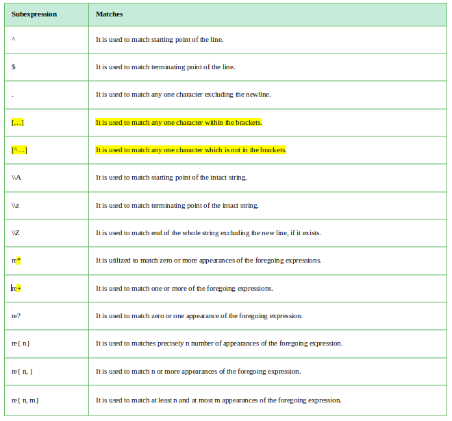
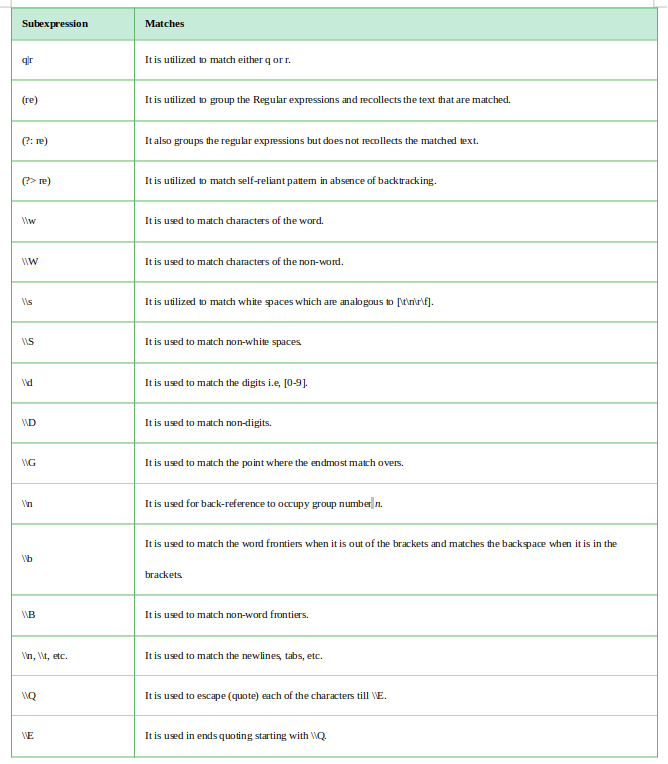

# Day 8: Pattern Matching and RegEx

## 1. Pattern Matching

* matches sequence of data
* similar to switch-case but used in lot complex problems.

### Example 1: simple pattern matching  

```scala
def MatchPattern(x: Int) = x match {
      case 1 => "One"
      case 2 => "Two"
      case _ => "None of the above"
      }

println(MatchPattern(2)) //Two

println(MatchPattern(1))//One

println(MatchPattern(12))//None of the above

```

### Example 2: Any datatype for input parameter and output parameter

```scala
def MathcPattern(x: Any) = x match {
     case 1 => "ONE"
     case 2 => "TWO"
     case "Three" => 3
     case "Four" => 4
     case _ => "None of the Above"
     }
//def MathcPattern(x: Any): Matchable

MathcPattern(1)
//val res3: Matchable = ONE

MathcPattern(2)
//val res4: Matchable = TWO

 MathcPattern("Three")
//val res5: Matchable = 3

MathcPattern("Threeeee")
//val res6: Matchable = None of the Above

```

### Example 3: using case class

* default for arguments/parameter is val(immutable)
* it generate some functions/methods automatically when you  define class as a case class. It includes methods like equals, hashcode, toString

```scala
  case class Car(name: String, cost: Int)
// defined case class Car

val mercedes = Car("Mercedes", 7000000)
//val mercedes: Car = Car(Mercedes,7000000)

val bmw = Car("BMW", 6000000)
//val bmw: Car = Car(BMW,6000000)

 val jaguar = Car("Jaguar", 10000000)
//val jaguar: Car = Car(Jaguar,10000000)

for (car <- List(mercedes, bmw, jaguar)){
    car match {
         case Car("Mercedes", 7000000) => println("Car is Mercedes, Congrats")
         case Car("BMW", 6000000) => println("Car is BMW")
         case Car("Jaguar", 10000000) => println("car is jaguar")
        }
    }

/*
Car is Mercedes, Congrats
Car is BMW
car is jaguar
*/           

for (car <- List(mercedes, bmw, jaguar)){
     car match{
          case Car(name,cost) => println(s"Car is $name and cost is $cost")
          }
     }

/*
Car is Mercedes and cost is 7000000
Car is BMW and cost is 6000000
Car is Jaguar and cost is 10000000
*/
```

## 2. Regular Expression

* Regular expression in scala is adapted from Java.
* Java regular expression is also adopted from Perl.
* `import scala.util.matching.Regex`
* you’ve to create an object of class Regex

**Syntax:**  
`val Pattern = new Regex(“Whatever you want ot match”)`  
or  
`val Pattern = “Whatever you want to match”.r`  

r – is a method/fn that is defined in Regex class and it does nothing but calls the constructor.  

### Example

```scala
import scala.util.matching.Regex

val pattern = new Regex("Hello")
//val pattern: scala.util.matching.Regex = Hello

val stringToFind = "Hello HOw are you? Hello again"
//val stringToFind: String = Hello HOw are you? Hello again

pattern findFirstIn stringToFind
//val res0: Option[String] = Some(Hello)

(pattern findAllIn stringToFind).mkString(", ")
//val res1: String = Hello, Hello

val pattern = "Hello".r   // instead of new Regex
//val pattern: scala.util.matching.Regex = Hello
  

var stringToFind = "my Name is NIvas, I'm 24 years old  and i study in MCA 4th semester"
//var stringToFind: String = my Name is NIvas, I'm 24 years old  and i study in MCA 4th semester

val pattern = "[0-9]+".r    //to find all the numbers in string
//val pattern: scala.util.matching.Regex = [0-9]+

(pattern findAllIn stringToFind).mkString(", ")
//val res2: String = 24, 4

(pattern findAllIn stringToFind).toArray   //all pattern in an array
//val res3: Array[String] = Array(24, 4)

val stringToFind = "Hello HOw are you? hello agian "
//val stringToFind: String = "Hello HOw are you? hello agian "

val pattern = "(H|h)ello".r // to match uppercase and lowercase both word. For both Hello and hello
//val pattern: scala.util.matching.Regex = (H|h)ello

(pattern findAllIn stringToFind).toArray
val res4: Array[String] = Array(Hello, hello)
```

### A. Using Regex with getorElse Function

```scala

val pattern = "(H|h)elloo".r
//val pattern: scala.util.matching.Regex = (H|h)elloo

(pattern findAllIn stringToFind).toArray
//val res5: Array[String] = Array()

val pattern = "helo".r
//val pattern: scala.util.matching.Regex = helo

(pattern findAllIn stringToFind).toArray
//val res6: Array[String] = Array()

val pattern = "hello".r
//val pattern: scala.util.matching.Regex = hello

pattern findFirstIn stringToFind getOrElse("No Match Found")
//val res8: String = hello

val pattern = "helloooooooooooooo".r
//val pattern: scala.util.matching.Regex = helloooooooooooooo

pattern findFirstIn stringToFind getOrElse("No Match Found")
//val res9: String = No Match Found

val pattern = "(H|h)ello".r
//val pattern: scala.util.matching.Regex = (H|h)ello

val stringToFind = "Hello HOw are you? hello agian "
//val stringToFind: String = "Hello HOw are you? hello agian "

pattern findAllIn stringToFind foreach(d => print(d + " "))
//Hello hello                                                                             
```

### Options for Regular expression forming

  


### Intermediate Stage

#### Example 1

```scala
val stringToFind = "Hello i'm Able to do it, abl11 able able0"
//val stringToFind: String = Hello i'm Able to do it, abl11 able able0

val pattern = "abl[ae]\\d+".r //abl and (a or e), \\d means digit, + one or more
//val pattern: scala.util.matching.Regex = abl[ae]\d+

pattern findAllIn stringToFind toArray
//val res4: Array[String] = Array(able0)

val pattern = "abl[ae]\\d*".r 
//val pattern: scala.util.matching.Regex = abl[ae]\d*

pattern findAllIn stringToFind toArray
//val res5: Array[String] = Array(able, able0)

val pattern = "[aA]bl[ae]\\d*".r
//val pattern: scala.util.matching.Regex = [aA]bl[ae]\d*

scala> pattern findAllIn stringToFind toArray
val res6: Array[String] = Array(Able, able, able0)
```

#### Example 2

```scala
import scala.util.matching.Regex // to create object of Regex
                                                                                
import scala.language.postfixOps // to enable postfix operation in scala
                                                                                
val pattern = "(-)?(\\d)(\\.\\d*)?".r 
// 1st char {(-)} -ve and optional
//2nd char {(\\d)} means number
//3rd char (\\.) means point and (\\d) means number followed by * which means 0 or more
// ? at the end indicate that 3rd char is optional 

//val pattern: scala.util.matching.Regex = (-)?(\d)(\.\d*)?

val stringToFind = "-1.5 into 4 is -6"
//val stringToFind: String = -1.5 into 4 is -6
                                                                                
pattern findAllIn stringToFind toArray
//val res0: Array[String] = Array(-1.5, 4, -6)    

val stringToFind = "-1.5  plus  4 is 2.5"
//val stringToFind: String = -1.5  plus  4 is 2.5
                                                                                
pattern findAllIn stringToFind toArray
//val res1: Array[String] = Array(-1.5, 4, 2.5)
/*
OR     
why double slash??
cuz single slash means escape character, if we don’t want to do that then use 3 inverted commas, as in multiline comment                                                                   
*/                                         
val pattern = """(-)?(\d)(\.\d*)?""".r
//val pattern: scala.util.matching.Regex = (-)?(\d)(\.\d*)?

val stringToFind = "-1.5 into 4 is -6"
//val stringToFind: String = -1.5 into 4 is -6

pattern findAllIn stringToFind toArray
//val res0: Array[String] = Array(-1.5, 4, -6)
```

#### Example 3. More difficult example by extracting the value from regular expression

```scala
val Decimal = """(-)?(\d)(\.\d*)?""".r
//val Decimal: scala.util.matching.Regex = (-)?(\d)(\.\d*)?
                                                                                
val Decimal(sign, integrepart, decimalpart) = "-1.23"
//val sign: String = -
//val integrepart: String = 1
//val decimalpart: String = .23

val stringToFind = "-1.5 into 4 is -6"
//val stringToFind: String = -1.5 into 4 is -6

for (Decimal(sign, integerpart, decimalpart) <- Decimal findAllIn stringToFind)
    println("Sign is " + sign + " Integer part is "+ integerpart + " Decimal part is " + decimalpart)

//Sign is - Integer part is 1 Decimal part is .5
//Sign is null Integer part is 4 Decimal part is null
//Sign is - Integer part is 6 Decimal part is null

val stringToFind = "-1.5  plus  4 is 2.5"
//val stringToFind: String = -1.5  plus  4 is 2.5

for (Decimal(sign, integerpart, decimalpart) <- Decimal findAllIn stringToFind)
     | println("Sign is " + sign + " Integer part is "+ integerpart + " Decimal part is " + decimalpart)

//Sign is - Integer part is 1 Decimal part is .5
//Sign is null Integer part is 4 Decimal part is null
//Sign is null Integer part is 2 Decimal part is .5

```

***
