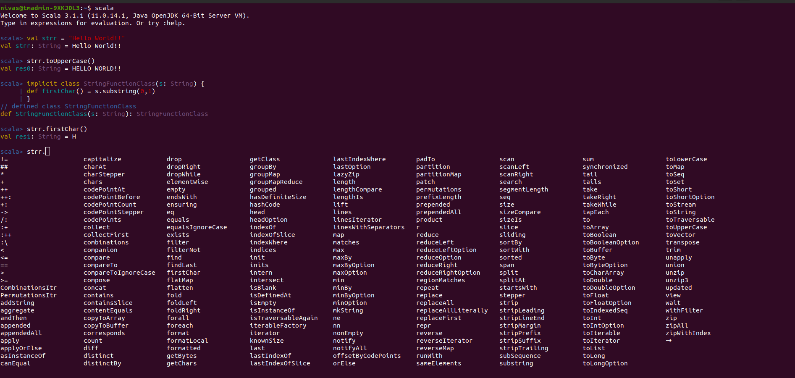
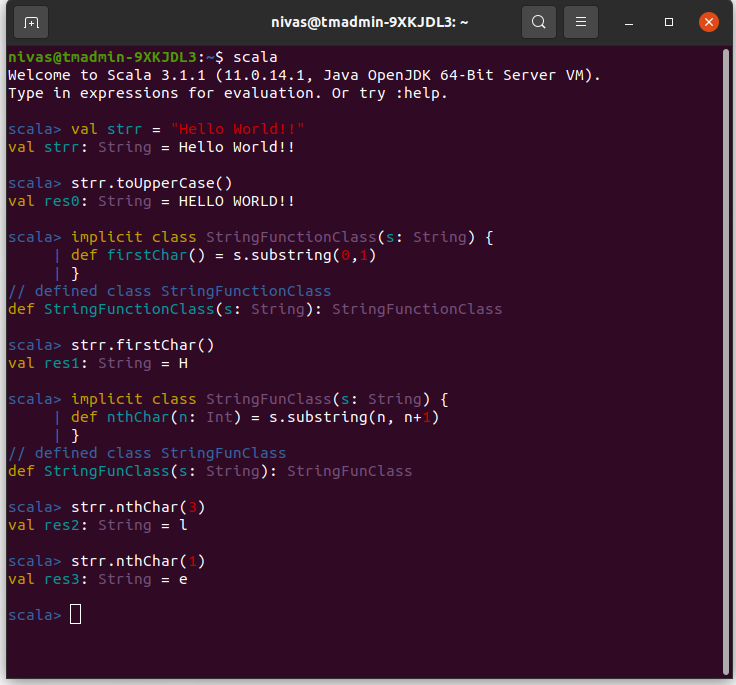

# 9A Implicit Class

```scala
val strr = "Hello World!!"
// val strr: String = Hello World!!

strr.toUpperCase()
//val res0: String = HELLO WORLD!!

implicit class StringFunctionClass(s: String) {
    def firstChar() = s.substring(0,1)
    }
// defined class StringFunctionClass
//def StringFunctionClass(s: String): StringFunctionClass

strr.firstChar()
//val res1: String = H
```

## All the functions available to strr. are



```scala
implicit class StringFunClass(s: String) {
    def nthChar(n: Int) = s.substring(n, n+1)
    }
// defined class StringFunClass

//def StringFunClass(s: String): StringFunClass

strr.nthChar(3)
//val res2: String = l

strr.nthChar(1)
//val res3: String = e


```



***
