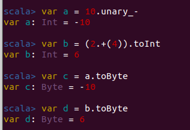

# Scala Programming in Depth By Harish Masand

## Day 1

* Created in 2004 by Martin Odersky
* scalable programming language
* Runs on std JVM i.e. Groovy, JRuby
* whey we use scala: Functional programming

* Till java 7 , it was OOP only in JAVA 8 they copied concept of fn programming from scala.  
  
## Programming in spork

* Scala(76%)
* JAVA (25%)
* Python, R for ML(10%)

## JVM

java --(java compiler) --> [.class] ---> [JVM]  
scala --(scala compiler) --> [.class] --> [JVM]  
scala have all features of java  

scala --> OOP + Functional Programming  
JAVA8 --> OOP + Functional Programming  

### Execution Env

* JAVA8
* scala
* IDE (Eclipse or intelliJ) (vs code not good for scala)
  
To execute the program java8 is enough, but to write it scala is also needed.  

#### Tools:For dependency mgmt

* Java : Maven
* Scala : sbt (scala build tool)

'Apache POI' package to read/write in excel  
packages are specified in scala in build.sbt  

### Java Vs Scala

|No.|  JAVA |Scala  |
|--- |----|---------|
|1.|**OOPS language**<br> Primitive dt: int, char, boolean, byte, long, float, double<br>Operators: + -, *, /, % |**Pure OOPS language**<br> No primitive dt, only object: Int, Float<br>Methods:  + -, *, /, % <br>i.e.  a +.(b)|

2.

```JAVA
//JAVA
public Static int Sum(int a, int b)//first int is return type and 2 and 3 is arg/params
{
    int c = a + b;
    return c;
}
```

```scala
 //Scala: we can write like java it's called impertive style but we write :
def Sum (a,b) = {a + b}
//or
def Sum(a:Int, b: Int) = {a + b}
```

| |     JAVA                                                      |SCALA          |
|---|-------------------------------------------------------------|-----------------------|
|3. | Always need to specify datatype<br> int c = a + b;          |No need to specify the datatype. (Static styped language) <br> val c = a + b<br> var a = a + b or <br> val c: Int = a + b<br> var c : Int = a + b<br> val =  value: never change the content of val,once assigned it'll not change<br>var = variable: changes according to our desire, can be reassigned.|
|4.| end of statement semicolon(;)<br> int a = 25;<br>int b = 2; |semicolon(;) is optional unless You're writing multiple lines in a line.<br>i.e.<br>val x = 5; val y = 2 |
|5.| sum(a,b)                                                    |a.sum(b)<br> a.equals(b) or<br> a equals b |
|6.| Diamond inheritance problem(Solved by interface in java)    |Scala avoids diamond inheritance problem using trait linearization It looks up the method implementation in the traits you extend from right to left.|


```scala
trait Base {
  def op: String
}

trait  Foo extends Base {
  override def op= "Foo"
}

trait  Bar extends Base {
  override def op= "Bar"
}

class A extends Foo with Bar
class B extends Bar with Foo

(new A).op //res0: String = Bar
(new B).op //res1: String = Foo
```

## Day 2: Basics of Scala

### a. Comments

* Single line:      //
* Multiple LIne:  /*...............*/

### b. Keywords

* Reserved words: internally used by scala,
  * can't define these words as a var or anything in a program
  * almost 50

### c. println: println("Hello World !")

### d. variables

```scala
var a = 5; a = 6 //allowed
val b = 5; b = 6 //not allowed vals are immutable and not reassignable

var a = 5 //or
var a : Int = 5

var b = 1.23f //or
var b: Float = 1.23 //or
var b: Float = 1.23f

var c = 1.23 // double by default
```

Default datatype for numbers:

* Int : 123
* Double : 1.23

For Byte and float you need to specify:

```scala
//Byte
var a: Byte = 12//or
var a = (12:Int).toByte //or
var a = 12.toByte

//Float
var a:Float = 1.23 //or
var a:Float = 1.23f //or
var a = 1.23f
```

```scala
var a = 129.toByte // gives output -127 why???
//Byte range = -128 to 127
// 8 bit = -2 ^ 8 to 2^7 - 1
```

```scala
var a: Byte = 5
var b: Byte = 7
var c = a + b
```

in the above example output will be `c: Int = 12` cuz `+` fn is not defined for Byte class  
 to correct this we need to do this.

```scala
var c = (a + b).toByte
```

In scala every operator is not operators but methods so following lines of code are the same

```scala
var c = a * 0 //or
var c = a.*(0)
```

#### REPL

  

similarly type conversion are defined at different classes in scala. I.e.

```scala
var a = 5.toByte //and
var a = 5.asInstanceOf[Byte]
```

above both lines gives the same output but they are defined in different classes.
They're functionally the same thing but toByte defined in Int class and asInstanceof is defined in Any class and can be used on any variable.

In scala we've  

* Any (Master Class) fn: asInstanceof[]
  * AnyVal(Subset)
    * Int fn: ToByte
    * Char fn: ToInt
    * Byte

```scala
var a: Any = 5
var c = a.toByte //error : masterclass can't use the fn of child class.
```

### <mark>In scala string and integer can be concatenated</mark>

### e. operators

1. Arithmetic: +, -, *, /, %
2. Relational: ==, !=, >, <, >=, <=, (gives boolean as output)
3. Logical: &&, ||, !
4. Assignment: =, +=, -=, *= /=, %= **=, <<==, >>=, &=, ^=, |=
5. Bitwise: &, |, ^, <<, >>, ~, >>>

* << : Binary left shift of left operand with right operand & assigning to the left
* (>>) :  Binary right  .................
* & : Bitwise And
* ^ : Bitwise Exclusive or
* | : Bitwise Inclusive or

### Prefix, Infix and Postfix

* Prefix: operator in Start
* Infix: operator in middle
* Postfix: operator in end
  
```scala
//Prefix
var a = -10
var a: Int = -10
var a = 10.unary_-

//Infix
var b = 2 + 5 //b: int = 7
var b = (2.+(4).toInt)

//Postfix
var c = a.toByte
var c = a toByte
```

#### REPL2



## Day 3: IntelliJ installation

## Day 4: Functions, Classes and Objects

Always create scala object , not class, cuz class code doesn't have option to run. It compiles successfully thought.  
class is not static: error .  
In scala <mark>static is not a keyword</mark>, so we can't define main fn as static . and object is static by default .  

## Function: Reusable piece of code

```scala
def ageCal(date: Date, db : Date): Int = { //date & dob are params/args and returntype is not mandatory
 //for params/args it is mandatory to specify the datatype why??: cuz fn doesn't know what'll be passed to params
  age = date - dob
  age //returning the last value
  //not necessary to specify return keyword
}
```

in scala the last line of code returns the output of the fn and reutrn keyword is used very rarely.

```scala
def addA (x: Int, y: Int): Int = {
  var z = x + y
  z // not necessary to specify return keyword
} 
```

```scala
def addB(x: Int, y: Int) = { // not mandatory to specify return type
  var z = x + y
  z
}
```

<mark>**If you specify return keyword then reutrntype is must**</mark>  
i.e.

```scala
def addC(x: Int, y: Int): Int = {
  var z = x + y
  return z
}
```

**If something is defined inside a class its method otherwise fn.**

## Classes and objects

| Class                              | Object                                                                                |
|------------------------------------|---------------------------------------------------------------------------------------|
| Collection of variables and methods | instance of class                                                                     |
|                                    | Using object we can access all the methods and variables that are defined in a class. |

```scala
//class
class Car {
  var topClassExtraCost = 0
  var roadTax = 100
  def cost(basicCost: Int): Int = basicCost + topClassExtraCost + roadTax
  }
//objects
var bmw = new Car
println(bmw.roadTax)  // 100
bmw.roadTax = 200
println(bmw.roadTax) //200
```

### Access level in scala

* Public: can access anwhere (default)
* Private: can access only in the defined class
* protected: can access in the class where it is defined as well as in subclas extending the given class using inheritence.

In the last example we only able to change/overwrite the roadTax, because it wa s public if it was private or protected then we wouldn't be able to do so.

```scala
//class and object demo
class CarB {
  var topClassExtraCost = 0
  private var roadTax = 100
  protected var xyz = 30
  def cost(basicCost: Int): Int = basicCost + topClassExtraCost + roadTax + xyz
}

class smallCarB extends CarB {
  //  println(roadTax) // produce error cuz private member of car class
  println(xyz)  //30
}
```

### Methods with side-effects

Since roadTax is private we can't access it, but using the checkTax() fn we can see the variable's value.

```scala
println(bmw.checkTax())
```

But if the developer change the value in the class by mistake then it's called method with side effect and  
then value will be change for all the objects, iff `checkTax()` is called

```scala
//class and object demo
class Car {
  var topClassExtraCost = 0
  private var roadTax = 100
  protected var xyz = 30
  def cost(basicCost: Int): Int = basicCost + topClassExtraCost + roadTax + xyz
  def checkTax():Int = {
    roadTax = 10
    roadTax
  }
}

class smallCar extends Car {
//  println(roadTax) // produce error cuz private member of car class
  println(xyz)
}

object carExample {
  def main(args: Array[String]): Unit = {
    var bmw = new Car
//    println(bmw.xyz) //error
    bmw.topClassExtraCost = 1000
    println("TopExtraCost of BMW is :" + bmw.topClassExtraCost)
    var result = bmw.cost(100000)
    println("Total cost of BMW: " + result)
    println("total tax on BMW: " + bmw.checkTax())

    var z = new Car
    println("extra cost of z:" + z.topClassExtraCost)
    println("total tax on z: " + bmw.checkTax())
  }
}

```

### Main Function: always written in object

```scala
object helloWorld {
  def main(args: Array[String]): Unit = {
    println("Hello World !!")
  }
}
```

### Another way to start the program: Alternate of main fn

```scala
object alternativeMain extends App {
  println("Hello World!")
  for (i <- 25 to 30) println(s" $i days !")
}
```

<h2 align="center"><sub>*** </sub> End <sub>***</sub></h2>


## Day 5: Constructors

When an object is created, something is called and that is constructor and then constructor creates an instance of the class.  
Two Types:

* Primary Constructor
* Auxilary Constructor

**Demo:**

 ```scala
class Demo {
  val x = 5
  val y = 3
  def getVAlue = {println(s"x = $x and y = $y")}
}
//objects
val demo1 = new Demo
val demo2 = new Demo
```

Example 1:

```scala

```
